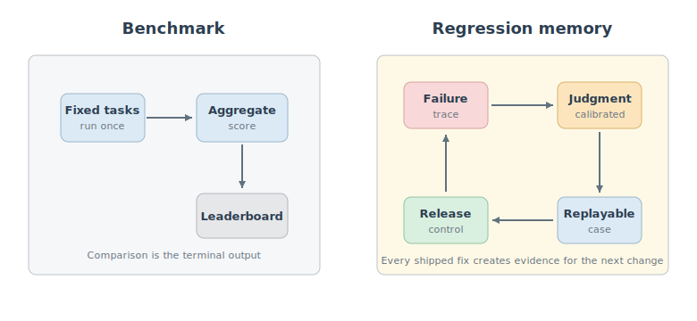
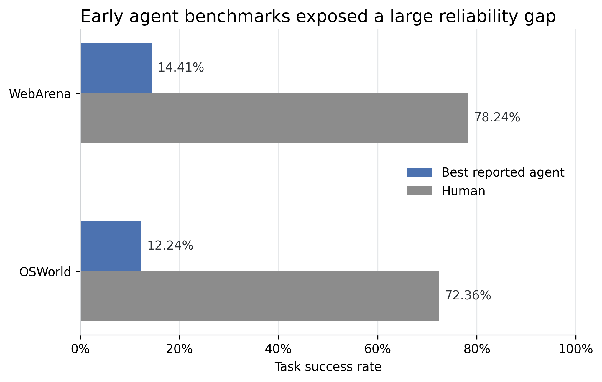
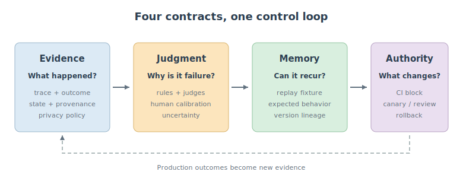
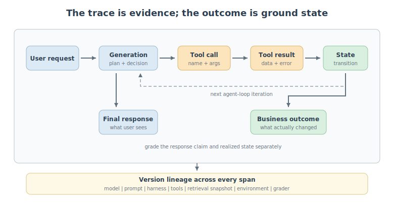
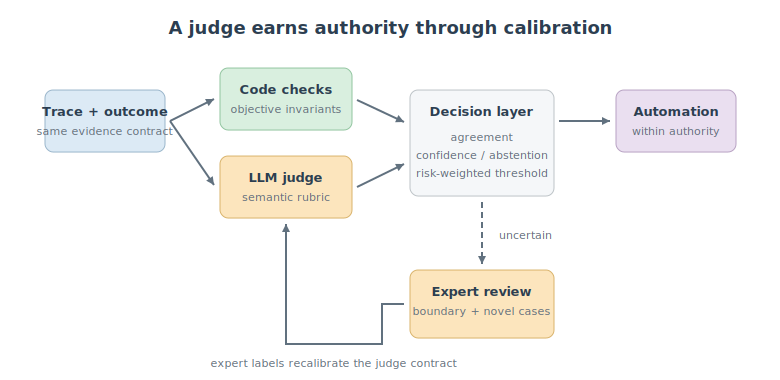
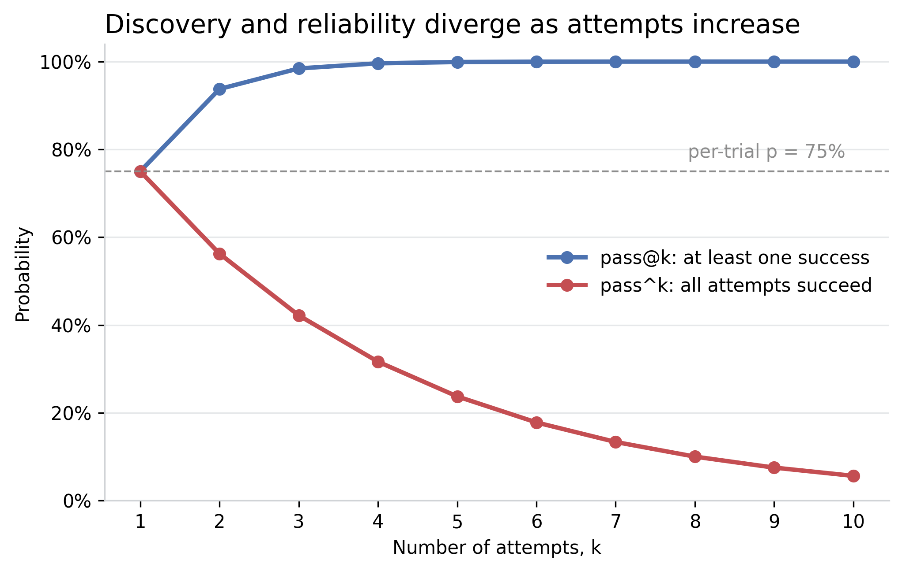
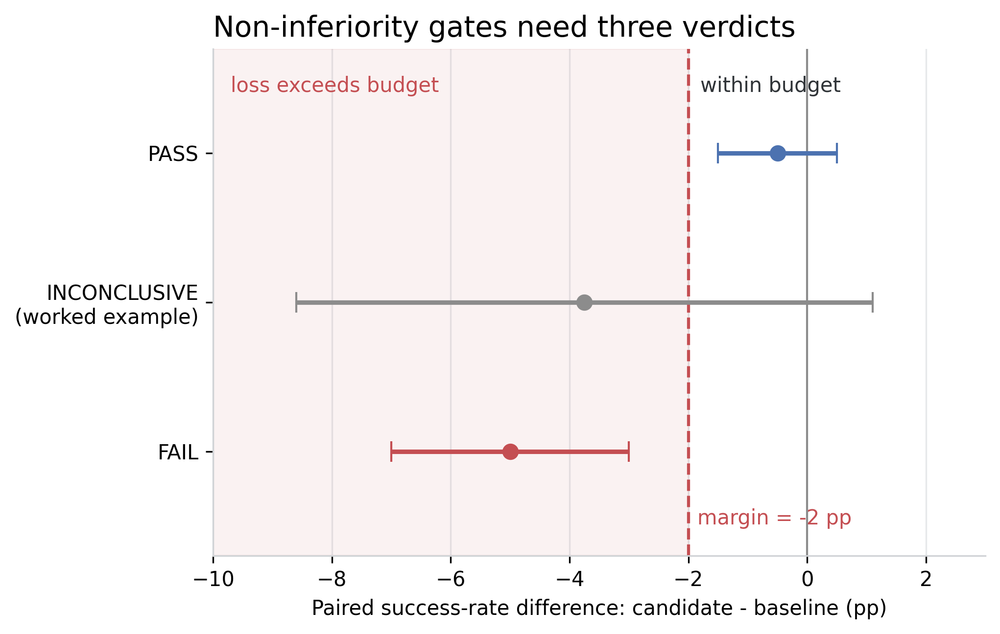
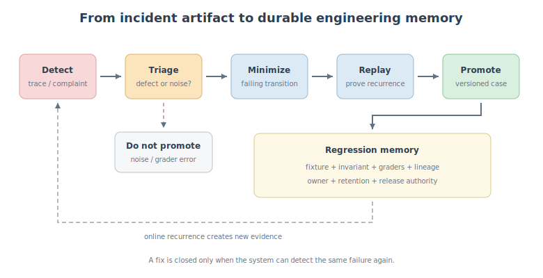
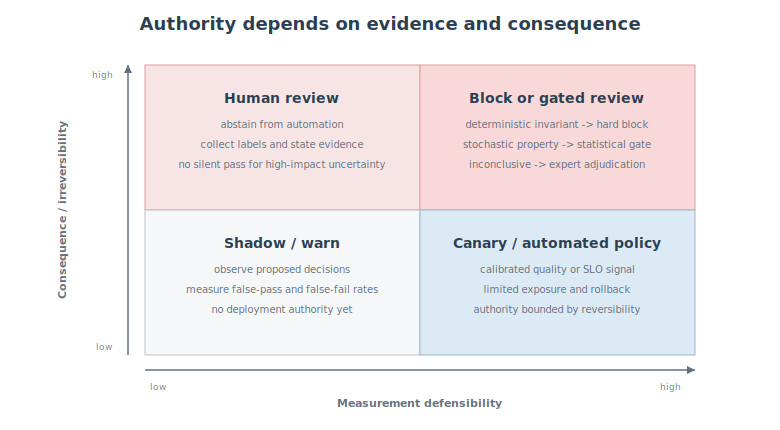

In the original [tau-bench experiments](https://arxiv.org/abs/2406.12045), state-of-the-art function-calling agents succeeded on **fewer than 50% of tasks**. That number was already sobering. The more revealing result appeared when the same task was run repeatedly: in retail, the probability of succeeding in all eight trials, $\text{pass}^8$, fell below **25%**.

An agent can therefore look capable on a leaderboard and still be unreliable for a user who expects the same policy to work every time.

This is the central mismatch in agent evaluation. A benchmark asks, "How well does this system perform on a fixed task set?" A production team needs answers to a different set of questions:

- What failed: the final answer, the tool path, or the environment state?
- Was the cause the model, prompt, tool schema, retrieved context, memory, policy, or recovery logic?
- Can the exact failure be replayed after one of those components changes?
- Is the evidence strong enough to block a release, or only strong enough to trigger review?
- Will the system remember this failure six months from now?

My thesis is simple:

**Production agent evaluation is the process of turning traces into regression memory.**

Benchmarks compare agents. Regression memory improves the engineering system around them. It captures a failure as versioned evidence, attaches a defensible judgment, converts it into a replayable test, and gives the result an explicit role in release control.

<figure>
<a href="assets/figure_benchmark_memory.svg" target="_blank" rel="noopener" title="Open full-size figure" style="display:block;box-shadow:none;text-decoration:none;border:0">

</a>
<figcaption>Figure 1: A benchmark ends at a score. A production evaluation system must feed evidence back into engineering and release control.</figcaption>
</figure>

This article develops that loop through four layers: **Evidence, Judgment, Memory, and Authority**. The framework is deliberately tool-agnostic. Products such as [LangSmith](https://docs.langchain.com/langsmith/evaluation), [MLflow](https://www.mlflow.org/docs/latest/genai/eval-monitor/running-evaluation/traces/), and OpenAI's [trace grading](https://platform.openai.com/docs/guides/trace-grading) can implement parts of it, but no dashboard can decide what your system must never forget.

This argument is adjacent to, but different from, Lilian Weng's [Harness Engineering for Self-Improvement](https://lilianweng.github.io/posts/2026-07-04-harness/). Her article asks how a harness can preserve failed attempts, mine verifier-grounded failure patterns, and improve itself without letting the editable system control its own evaluator. This article focuses on the control plane around that loop: **what evidence must exist before a stochastic system that acts on an environment is allowed to change or ship**. Self-improvement proposes changes. Regression memory determines which changes have earned authority.

## A Benchmark Is a Snapshot, Not a Control System

A benchmark is a standardized experiment for comparison. It becomes a control system only when its evidence is tied to the product's actual failure distribution, version history, and release decisions.

Benchmarks have done essential work for agents. [WebArena](https://arxiv.org/abs/2307.13854) showed a historical gap of **14.41%** task success for its best GPT-4-based agent versus **78.24%** for humans. [OSWorld](https://arxiv.org/abs/2404.07972) reported **12.24%** for its best evaluated model versus **72.36%** for humans across 369 computer tasks. These results made long-horizon tool use measurable and exposed failures that static language benchmarks missed.

<figure>
<a href="assets/figure_benchmark_gap.png" target="_blank" rel="noopener" title="Open full-size figure" style="display:block;box-shadow:none;text-decoration:none;border:0">

</a>
<figcaption>Figure 2: Early environment benchmarks exposed a roughly 60-point reliability gap between the best evaluated agents and humans. Values are from the original WebArena and OSWorld papers.</figcaption>
</figure>

But these numbers do not tell a product team whether yesterday's prompt change broke refunds for premium customers. They cannot tell whether a successful final response hid an unauthorized side effect. They do not preserve the database state, retrieved documents, tool versions, or approval decisions required to reproduce a production incident.

The distinction is not between a public benchmark and a private one. A private collection of 500 prompts is still just a benchmark if it is periodically run, summarized into one score, and then forgotten.

The operational difference is whether the evaluation has a feedback path:

1. A real or anticipated failure produces structured evidence.
2. A grader makes a calibrated, reviewable judgment.
3. The failure becomes a versioned regression case.
4. The case is assigned an explicit role in CI gating, canary deployment, rollback, or human review.

This leads to a useful distinction:

**Capability evaluation asks what the agent can do. Regression evaluation asks what the engineering system refuses to forget.**

[Anthropic's agent-eval guidance](https://www.anthropic.com/engineering/demystifying-evals-for-ai-agents) makes a similar operational distinction: capability suites should contain difficult tasks with room to improve, while regression suites should approach 100% pass rates and run continuously. A capability case can "graduate" into regression protection once the system reliably handles it.

That transition is the beginning of memory. It is not yet the complete control system.

## Four Layers: Evidence, Judgment, Memory, Authority

An evaluation result is trustworthy only if four separate contracts hold: the evidence represents what happened, the judgment measures the intended property, the memory can reproduce the case, and the authority matches the uncertainty of the signal.

<figure>
<a href="assets/figure_four_layers.svg" target="_blank" rel="noopener" title="Open full-size figure" style="display:block;box-shadow:none;text-decoration:none;border:0">

</a>
<figcaption>Figure 3: The four contracts of production agent evaluation. Weakness in any layer breaks the improvement loop.</figcaption>
</figure>

The separation matters because teams frequently compress all four layers into one sentence: "The evaluator gave this run 0.72, so the candidate is better." That sentence hides at least four unproven claims:

- The evaluator saw the relevant state and actions.
- A score of 0.72 corresponds to the failure property we care about.
- The run can be reconstructed under a future candidate.
- A score of 0.72 provides enough evidence to permit or reject a deployment.

The rest of this article examines each contract in order.

## Evidence: The Trace Is the Unit of Diagnosis

The correct evidence unit for an agent is normally a trace plus the resulting environment state, not a prompt-response pair. A final answer is only one observation emitted by a stateful process.

Suppose a support agent says, "Your refund has been processed." At least four realities are possible:

- the refund exists and the response is correct;
- the tool failed but the agent claimed success;
- the refund succeeded twice because a retry was not idempotent;
- the refund succeeded, but the agent skipped identity verification.

The final text is nearly identical. The product outcomes are not.

[Anthropic](https://www.anthropic.com/engineering/demystifying-evals-for-ai-agents) defines a transcript as the complete record of outputs, tool calls, reasoning, and intermediate results, while the outcome is the final environment state. [OpenAI's trace-grading guidance](https://platform.openai.com/docs/guides/trace-grading) similarly treats the end-to-end log of decisions and tool calls as the object to grade. This is more than observability. It changes what can be tested.

A minimum useful trace looks like a span tree:

```text
agent_run
|- user_request
|- model_generation
|  |- retrieval
|  |- memory_read
|  `- tool_call
|     `- tool_result
|- state_update
|- model_generation
|  `- tool_call
|     `- tool_result
|- final_response
`- business_outcome
```

<figure>
<a href="assets/figure_trace_anatomy.svg" target="_blank" rel="noopener" title="Open full-size figure" style="display:block;box-shadow:none;text-decoration:none;border:0">

</a>
<figcaption>Figure 4: Final-answer grading sees the right edge. Diagnosis requires the path and the external state created along it.</figcaption>
</figure>

Each span should carry enough provenance to answer three questions: what happened, under which system version, and what evidence may be safely retained. A practical schema includes:

```yaml
trace:
  trace_id: tr_7f2a
  task_id: refund_duplicate_charge
  started_at: 2026-07-21T09:13:22Z
  agent:
    model: model_name_and_snapshot
    prompt_version: support-v37
    harness_version: git:8ea41c2
    tool_schema_version: billing-api-v12
  environment:
    fixture_version: retail-sim-2026-07
    initial_state_hash: sha256:...
  spans:
    - type: tool_call
      name: process_refund
      arguments_ref: encrypted://...
      result_ref: encrypted://...
      latency_ms: 812
  outcome:
    final_state_hash: sha256:...
    refund_count: 1
    identity_verified: true
```

[OpenTelemetry's GenAI semantic conventions](https://opentelemetry.io/docs/specs/semconv/registry/attributes/gen-ai/) now define common attributes for agent identity, conversations, model requests, retrieval, tool arguments, tool results, and evaluation scores. That standardization is useful, but the specification also warns that prompts, retrieved content, tool arguments, and results may contain sensitive data.

Therefore, "trace everything" is not a production design. Evidence collection requires a data policy:

- redact secrets and direct identifiers before export;
- store large or sensitive payloads by encrypted reference, not as unrestricted span attributes;
- record hashes and schema versions even when content cannot be retained;
- define retention by risk and review value;
- replay production evidence only inside isolated environments;
- separate access to telemetry metadata from access to raw user content.

A trace without content may be insufficient for semantic diagnosis. A trace with all content may be a privacy incident. The evidence contract must state which claims remain possible after redaction.

### Failure Location Before Root Cause

A trace helps localize where observed behavior diverged, but it does not automatically identify root cause. "The wrong tool was called" is a failure location. It could be caused by an ambiguous user goal, misleading retrieval, overlapping tool descriptions, a stale schema, a planner error, or a policy bug.

A useful first-pass taxonomy follows the state transitions of the system:

- **Goal interpretation**: the agent optimized the wrong objective.
- **Context acquisition**: retrieval or memory supplied missing, stale, or misleading evidence.
- **Planning**: the chosen sequence could not satisfy the goal or policy.
- **Tool selection**: the agent chose the wrong capability.
- **Argument construction**: the right tool received invalid or unsafe parameters.
- **Execution**: the environment timed out, returned partial results, or violated assumptions.
- **State management**: the agent lost, duplicated, or contaminated persistent state.
- **Recovery**: a recoverable error became a terminal or repeated failure.
- **Response grounding**: the final claim did not match the realized state.

This taxonomy should point to an owner and a candidate fix, not merely decorate a dashboard. The root cause remains a hypothesis until a controlled change or replay distinguishes competing explanations.

## Judgment: A Grader Is a Measurement Instrument

A grader should be treated as a measurement instrument with a known operating range, not as an oracle. Different evidence calls for different instruments.

Three broad grader families cover most agent systems:

### Deterministic Graders

Use code when the property can be encoded without semantic ambiguity. Examples include JSON-schema validity, database end state, unauthorized tool use, secret-pattern matches, step budgets, idempotency keys, unit tests, and latency limits.

These checks are cheap, reproducible, and easy to debug. Their weakness is brittleness: a rule may reject a valid alternative path or miss a semantically wrong action that satisfies the schema.

### Model-Based Graders

Use an LLM judge for properties such as instruction fulfillment, evidence support, interaction quality, plan coherence, or whether a tool trajectory plausibly achieved an open-ended goal.

These graders handle variation, but they introduce a second stochastic model into the measurement chain. [AgentRewardBench](https://arxiv.org/abs/2504.08942) evaluated 12 LLM judges on 1,302 expert-annotated web-agent trajectories across five benchmarks. No single judge was best across all benchmarks, and no evaluated judge exceeded **70% overall precision** for success prediction. The strongest reported GPT-4o variant reached 69.8% precision and 83.1% recall: roughly three in ten trajectories it labeled successful were not successful under expert review. The opposite error appeared in rigid rules. For GPT-4o acting on WebArena, experts measured 42.3% success while the official rule-based evaluator measured 25.6%. A flexible judge and a deterministic rule therefore fail in different directions; neither is a universal ground truth.

### Human Graders

Use domain experts for ambiguous, high-impact, novel, or disputed cases. Human review is not automatically ground truth: reviewers can disagree, become fatigued, or lack access to the actual environment state. But carefully designed expert labels remain the reference needed to calibrate automated graders.

The engineering answer is a cascade, not a winner:

```text
deterministic invariant
    -> model-based semantic judgment
        -> disagreement / uncertainty detector
            -> expert review
```

<figure>
<a href="assets/figure_judge_governance.svg" target="_blank" rel="noopener" title="Open full-size figure" style="display:block;box-shadow:none;text-decoration:none;border:0">

</a>
<figcaption>Figure 5: Automated judges scale review; expert labels establish and periodically re-check their decision boundary.</figcaption>
</figure>

### Calibration Before Automation

Before a judge can influence deployment, construct a calibration set that over-samples consequential boundary cases. For a binary property, report the confusion matrix rather than reporting only agreement or correlation:

```text
                         Expert: fail   Expert: pass
Judge: fail              true fail      false fail
Judge: pass              false pass     true pass
```

The two errors have different costs. A false fail wastes review and blocks valid changes. A false pass lets a regression through. For an irreversible financial action, false-pass risk dominates. For a style preference, false-fail cost may dominate.

Calibration must therefore be slice-specific and cost-sensitive. Suppose an intentionally hard refund-policy calibration slice contains 200 expert-labeled traces, including 40 actual policy failures. If the judge passes six of those failures, its failure recall is 85%, but the operational fact is sharper: **15% of known failures escaped the automated gate**. Even a high aggregate agreement score cannot justify release authority if the tolerated false-pass rate for irreversible payments is 1%. The correct response is to tighten the rubric, add deterministic state checks, or route this slice to expert review rather than average it with easy cases.

A production judge contract should record:

- the exact rubric and judge model version;
- which information is available to the judge but not to the acting agent;
- precision and recall on each risk slice, not only aggregate accuracy;
- an abstention region for insufficient or conflicting evidence;
- the sampling policy for human review;
- recalibration triggers after prompt, model, tool, or data-distribution changes.

Information parity deserves special attention. If the judge sees a reference answer or future environment state unavailable to the agent, it may identify failure but cannot fairly assess whether the action was reasonable at the time. Conversely, if the judge cannot see tool outputs or final state that the agent used, it may confidently grade the wrong object.

The practical rule is:

**A judge may have broader evidence than the agent, but the rubric must distinguish outcome correctness from decision quality given the information available at that step.**

## Stochastic Regression Requires Statistical Decisions

An agent test is a random variable, not a Boolean fact. One successful replay proves only that one sampled trajectory succeeded.

The distinction between $\text{pass@}k$ and $\text{pass}^k$ makes this intuitive. If a trial succeeds independently with probability $p$:

$$
\text{pass@}k = 1 - (1-p)^k,
$$

$$
\text{pass}^k = p^k.
$$

$\text{pass@}k$ asks whether at least one of $k$ attempts succeeds. It rises with more attempts. $\text{pass}^k$ asks whether all $k$ attempts succeed. It falls with more attempts.

At $p=0.75$, three attempts produce $\text{pass@}3 \approx 98.4\%$ but $\text{pass}^3 \approx 42.2\%$. The first metric fits search or candidate generation, where one good result may be enough. The second fits customer-facing workflows that must behave correctly every time.

<figure>
<a href="assets/figure_reliability_divergence.png" target="_blank" rel="noopener" title="Open full-size figure" style="display:block;box-shadow:none;text-decoration:none;border:0">

</a>
<figcaption>Figure 6: More attempts make discovery look better and repeated reliability look worse. The curves assume independent trials with per-trial success probability 0.75.</figcaption>
</figure>

This has a direct implication for continuous integration: **a single replay cannot establish non-regression for a stochastic agent.**

Let $p_b$ be the baseline success probability and $p_c$ the candidate probability on the same regression slice, with $\Delta=p_c-p_b$. Define the acceptable regression budget as $\delta$. A non-inferiority gate should permit shipping only when the lower confidence bound for the difference remains above the allowed loss:

$$
\operatorname{LCB}_{1-\alpha}(\Delta) > -\delta.
$$

The intuition is simple: do not ask, "Did the candidate score higher?" Ask, "Does the evidence rule out a harmful degradation larger than our budget?"

This naturally creates three verdicts:

- **PASS**: evidence rules out an unacceptable regression.
- **FAIL**: evidence supports an unacceptable regression or a hard invariant was violated.
- **INCONCLUSIVE**: the sample is too small or too noisy; run more trials or request review.

### A Paired Non-Inferiority Example

Consider 160 replay fixtures, each run once with the baseline and once with the candidate under matched environment conditions. The paired outcomes are:

```text
                                      Candidate pass   Candidate fail
Baseline pass                              103               11
Baseline fail                                5               41
```

Only the discordant pairs identify a change: the candidate fixes five baseline failures but introduces 11 new failures. The estimated paired difference is

$$
\widehat{\Delta} = \frac{5-11}{160} = -0.0375.
$$

Using a normal approximation for illustration, the 95% paired interval is approximately $[-8.6, 1.1]$ percentage points. If the predeclared regression budget is $\delta=2$ points, the result is **INCONCLUSIVE**: the lower bound does not establish non-inferiority, but the upper bound does not establish a harmful regression either. Shipping because a conventional two-sided difference test is "not significant" would confuse absence of evidence with evidence of non-inferiority.

<figure>
<a href="assets/figure_paired_gate.png" target="_blank" rel="noopener" title="Open full-size figure" style="display:block;box-shadow:none;text-decoration:none;border:0">

</a>
<figcaption>Figure 7: A predeclared non-inferiority margin turns uncertainty into three actions. The middle interval is the 160-pair worked example; the other rows are illustrative decision cases.</figcaption>
</figure>

For paired binary outcomes, inference should use [methods designed for matched proportions](https://pmc.ncbi.nlm.nih.gov/articles/PMC9447366/), such as an appropriate paired interval or bootstrap over independent fixtures. The pairing matters: it controls task difficulty and focuses the estimate on cases where behavior changed. The confidence procedure must match the design rather than treating 320 runs as independent Bernoulli samples.

The independence assumption is also easy to break. Repeated runs that share a mutable sandbox, cached retrieval, user-simulator state, or a seed family are clustered observations. In that case, resample at, or explicitly model, the independent unit, usually the task-environment fixture, rather than individual trajectories. Otherwise the interval will be too narrow.

Two more rules prevent statistical theater:

- **Predeclare sequential decisions.** Recomputing an ordinary 95% interval after every batch and stopping when it passes inflates the false-positive rate. Use a fixed maximum budget with an alpha-spending design, a sequential probability ratio test, or another anytime-valid procedure.
- **Protect risk slices from aggregation.** Testing many tools, segments, and failure modes creates multiple-comparison risk. Critical invariants should remain separate gates; exploratory slices need a declared family-wise error-rate or false-discovery-rate policy. A global average must never compensate for a known critical regression.

There is no universal value of $k$. The trial budget depends on the smallest harmful regression $\delta$, baseline reliability, desired confidence and power, clustering, and decision cost. Estimate those quantities before the run; do not choose eight trials merely because an example configuration contains eight.

[AgentAssay](https://arxiv.org/abs/2603.02601), a 2026 technical report focused on stochastic agent regression testing, formalizes this three-valued approach and CI/CD gates as statistical decision procedures. Across 7,605 trials, it reports that sequential testing reduced required trials by **78%**, while behavioral trace fingerprints detected regressions with **86% power** in a setting where binary pass-rate testing detected none. These are early technical-report results rather than a settled industry standard, but they expose the right problem: binary outcomes can miss behavioral drift, and fixed trial counts waste budget on stable cases.

For production systems, the minimum statistical discipline is:

- pair baseline and candidate runs on the same task and environment fixture;
- run multiple trials for stochastic properties;
- stratify by risk and failure type before aggregating;
- report uncertainty, not only a point estimate;
- reserve zero-tolerance gates for deterministic invariants with reliable observability;
- return `INCONCLUSIVE` instead of converting weak evidence into false certainty.

## Coverage Is a Model of the Failure Surface

Evaluation coverage measures the ways in which the system can fail, not how many prompts are in a dataset. A suite of 10,000 near-duplicate happy paths may cover less than 50 carefully selected state transitions.

A useful coverage model for agents is multi-dimensional:

$$
\begin{aligned}
\mathcal{C} = (&C_{\text{goal}}, C_{\text{tool}}, C_{\text{path}}, C_{\text{state}},\\
&C_{\text{boundary}}, C_{\text{environment}}, C_{\text{risk}}).
\end{aligned}
$$

In plain language:

- **Goal coverage**: which user intents and ambiguity patterns are represented?
- **Tool coverage**: which capabilities, argument classes, failures, and retries are exercised?
- **Path coverage**: which meaningful action sequences and handoffs occur?
- **State coverage**: which initial, intermediate, and corrupted states are tested?
- **Boundary coverage**: which thresholds, permissions, budgets, and policy edges are crossed?
- **Environment coverage**: which latency, partial failure, schema, and dependency conditions appear?
- **Risk coverage**: which severity levels and affected user segments are represented?

[AgentAssay](https://arxiv.org/abs/2603.02601) proposes a related five-dimensional tuple over tools, paths, states, boundaries, and models. The important idea is that aggregate task count is not a defensible coverage metric.

Coverage becomes actionable when connected to mutation testing. If you deliberately remove a required identity check, corrupt a tool result, rename a schema field, duplicate a retry, or inject stale memory, does at least one test or grader reject the run? If not, the suite has a blind spot even when every existing test passes.

This borrows a mature idea from software testing: mutation testing evaluates a test suite by injecting plausible faults and measuring whether tests detect them. The classic survey by [Jia and Harman](https://doi.org/10.1109/TSE.2010.62) treats mutation score as evidence about fault-detection effectiveness, not as proof of correctness. Agent systems extend the mutation surface beyond code into prompts, context, tools, state, orchestration, and models.

[Metamorphic testing](https://doi.org/10.1145/3143561) adds a second useful technique when no single output is canonical. Instead of asserting one exact trajectory, specify relations that should remain true across transformed inputs. For example, paraphrasing a refund request should not change eligibility; reordering irrelevant retrieved documents should not change the cited evidence; lowering a requested refund below an approval threshold may remove an approval step but must not remove identity verification. These relations test behavioral invariants without forcing one brittle path.

Useful agent mutations include:

- prompt mutation: remove or contradict a key instruction;
- tool mutation: change a schema, permission, timeout, or return value;
- context mutation: omit or duplicate a retrieved fact, replace it with a stale version, or inject poisoned context;
- state mutation: start from a partial or conflicting environment state;
- orchestration mutation: reorder steps, skip approval, or repeat an action;
- model mutation: change the provider, checkpoint, or sampling policy.

The goal is not exhaustive Cartesian-product testing. It is a risk-weighted map showing which important failure mechanisms have evidence and which remain assumptions.

## Memory: A Failure Must Become a Versioned Asset

Regression memory is a versioned collection of failure cases, expected behavior, replay fixtures, graders, and decision policies. A trace becomes memory only when a future system can use it to prevent recurrence.

A screenshot in an incident ticket is not regression memory. Neither is a trace URL that expires in 30 days. The minimum durable object looks like this:

```yaml
regression_case:
  id: REG-2026-0142
  created_from:
    trace_id: tr_7f2a
    incident_id: INC-884
  failure:
    type: skipped_identity_verification
    severity: critical
    failed_transition: verify_identity -> process_refund
    invariant: "Refund requires verified customer identity"
  replay:
    inputs_ref: fixtures/refund-duplicate-charge.json
    initial_state_ref: snapshots/retail-sim-2026-07.tar.zst
    expected_outcome:
      refund_count: 1
      identity_verified: true
  provenance:
    model_version: model-snapshot
    prompt_version: support-v37
    harness_version: git:8ea41c2
    tool_schema_version: billing-api-v12
    grader_version: identity-policy-v4
  evaluation:
    trials: 8
    scorers:
      - identity_verified_state_check
      - no_duplicate_refund_check
      - response_grounded_in_outcome_judge
  authority:
    policy: block_release
    owner: payments-reliability
```

<figure>
<a href="assets/figure_regression_lifecycle.svg" target="_blank" rel="noopener" title="Open full-size figure" style="display:block;box-shadow:none;text-decoration:none;border:0">

</a>
<figcaption>Figure 8: Regression memory is curated, not automatic. Noise and grader errors are not promoted; validated failures become durable release evidence.</figcaption>
</figure>

The promotion process matters. Not every bad-looking trace should become a permanent test:

1. **Detect** a user complaint, outcome anomaly, judge failure, or deterministic violation.
2. **Triage** whether it is a product defect, expected variation, infrastructure noise, or grader error.
3. **Minimize** the case while preserving the failing state transition.
4. **Specify** the invariant or expected outcome in reviewable language.
5. **Reproduce** the failure against the original version in an isolated fixture.
6. **Validate** that the proposed fix passes without weakening unrelated regression slices.
7. **Promote** the case with an owner, retention policy, and release authority.
8. **Retire or migrate** it only when the product contract changes explicitly.

This curation prevents two pathologies. The first is **noise accumulation**, where flaky or ambiguous cases make the suite untrusted. The second is **policy fossilization**, where outdated behavior remains enforced because nobody recorded why a case existed.

OpenAI describes a concrete production version of this loop in its work on [self-improving tax agents](https://openai.com/index/building-self-improving-tax-agents-with-codex/): practitioner corrections are compared with system outputs, recurring differences are grouped to separate product failures from workflow noise, actionable patterns become targeted evals, and fixes are validated against broader regression suites. The key design choice is that a correction does not automatically become a task. It first becomes reviewed evidence.

Weng's harness framework pushes the same principle into self-improving systems: negative results are retained, failures are grouped by causal mechanism, proposed harness edits state both the failures they are expected to fix and the regressions they may introduce, and held-out evaluators remain outside the editable loop. Regression memory supplies the release contract for that architecture. A self-generated patch is still only a candidate until independent evidence shows that it repaired the target mechanism without exceeding the risk budget elsewhere.

## Authority: Not Every Score Should Block a Release

Evaluation authority is the explicit mapping from evidence quality and risk to an engineering action. Without this layer, evals become dashboards that teams consult when convenient.

The strongest available signal should not automatically receive the strongest authority. Authority should depend on observability, calibration, reversibility, and expected loss.

A practical release policy has four levels:

### Hard Block

Use for deterministic, high-impact invariants with low evaluator ambiguity: unauthorized transfers, missing required approval, schema corruption, secret exposure, duplicated irreversible actions, or failure of executable acceptance tests.

### Statistical Block or Review

Use for stochastic properties evaluated through repeated trials and a predeclared non-inferiority gate. High-impact slices route inconclusive results to expert review instead of silently passing.

### Warning and Canary

Use for calibrated but subjective quality signals, cost increases, trajectory inefficiency, and new failure clusters. Deploy to a limited traffic slice, compare business outcomes, and preserve rollback capability.

### Shadow Monitoring

Use for new graders, weak labels, novel anomaly detectors, and signals without measured false-pass rates. Record the action the evaluator would have taken, but do not let it control users yet.

<figure>
<a href="assets/figure_release_authority.svg" target="_blank" rel="noopener" title="Open full-size figure" style="display:block;box-shadow:none;text-decoration:none;border:0">

</a>
<figcaption>Figure 9: Measurement defensibility and consequence are separate axes. High consequence with weak evidence requires human review, not stronger automated authority.</figcaption>
</figure>

An implementation can encode the policy directly:

```python
def decide_release(candidate, baseline, cases):
    results = replay_paired(candidate, baseline, cases)

    if results.any_deterministic_invariant_violation():
        return "BLOCK"

    for risk_slice in results.slices():
        delta_ci = risk_slice.non_inferiority_interval()
        budget = allowed_regression[risk_slice.severity]

        if delta_ci.upper < -budget:
            return "BLOCK"
        if delta_ci.lower <= -budget:
            return "HUMAN_REVIEW"  # Evidence is inconclusive.

    if results.judge_drift_detected():
        return "SHADOW_ONLY"
    if results.quality_warning() or results.cost_slo_regressed():
        return "CANARY"
    return "SHIP"
```

The interval estimator must match the experimental design, but the decision rule must also be declared before the candidate is examined. Otherwise, teams move thresholds until a preferred release passes.

Offline eval, CI gating, and online monitoring also have different jobs:

- **Offline evaluation** compares candidate behavior on controlled, replayable evidence.
- **CI gating** converts a subset of that evidence into a pre-deployment decision.
- **Online monitoring** discovers distribution shift, unknown failures, and real business outcomes.

[LangSmith](https://docs.langchain.com/langsmith/evaluation) and [MLflow](https://www.mlflow.org/docs/latest/genai/eval-monitor/running-evaluation/traces/) both expose this two-way pattern: production traces feed datasets and evaluators; offline experiments test candidate changes; online scoring monitors what controlled suites miss. The architecture matters more than the vendor.

## Worked Example: From Duplicate Refund to Release Decision

The refund scenario can now be carried through the complete loop.

**1. Evidence.** A production trace shows that the agent called `process_refund`, received a timeout, retried without an idempotency key, and produced two successful ledger entries. Its final response claimed one refund. The failed span is not the response generation; it is the transition from an uncertain tool outcome to an unreconciled retry. The trace retains tool request IDs, timeout metadata, ledger state, model and prompt versions, and the approval decision, with customer identifiers redacted.

**2. Judgment.** Two deterministic graders assert `refund_count == 1` and that the same idempotency key is reused across retries. A semantic judge checks whether the final response is grounded in the ledger state, but it does not decide whether money moved twice. On a labeled slice of timeout and retry traces, the semantic judge's false-pass rate is measured separately from non-timeout refunds. Disagreements and abstentions go to payments experts.

**3. Memory.** Triage rules out a duplicated webhook and reproduces the defect in an isolated billing simulator. The minimal fixture contains one eligible order, a first call that commits but times out before acknowledgment, and a retry. The durable case records the invariant, failed transition, simulator snapshot, relevant versions, grader contracts, owner, and why the test exists. A prompt-only fix that merely changes the final wording cannot pass the state grader.

**4. Candidate comparison.** The proposed harness change adds an idempotency key and a read-after-timeout reconciliation step. The baseline and candidate are run on matched copies of the fixture, including timeout timing variants. The critical duplicate-refund invariant has zero tolerance: a single reproducible violation blocks release. Recovery success is stochastic, so it uses a paired non-inferiority interval and returns `PASS`, `FAIL`, or `INCONCLUSIVE`. The broader suite also checks that reconciliation does not create unacceptable latency or block legitimate second refunds.

**5. Authority and online confirmation.** A candidate that violates the state invariant is blocked regardless of aggregate score. An inconclusive recovery result triggers additional trials or expert review; it is not silently passed. A statistically acceptable candidate enters a low-volume canary deployment with duplicate-ledger monitoring and automatic rollback. Only after the online outcome matches the offline contract does the change graduate, while the original incident remains a permanent regression asset.

This example exposes why an eval is not merely a scorer. The useful artifact is the chain of custody that connects production state to a calibrated decision, a replayable case, and explicit deployment authority.

## A Minimum Viable Agent Evaluation Loop

A small team does not need hundreds of tasks or a dedicated evaluation platform to begin. It needs one complete feedback loop with explicit ownership.

[Anthropic](https://www.anthropic.com/engineering/demystifying-evals-for-ai-agents) recommends starting with **20-50 tasks** drawn from manual checks, support queues, and real failures. That is enough when early product changes have large effects. The mistake is waiting for a perfect dataset while production incidents continue to disappear into tickets.

The minimum viable system has seven components:

1. **Structured traces and outcome capture** for every high-value workflow.
2. **A small failure taxonomy** aligned with components and engineering owners.
3. **Deterministic checks first**, especially for state, permission, and schema invariants.
4. **One or two calibrated semantic judges** for properties code cannot express.
5. **A reviewed regression-case store** with fixtures and complete version lineage.
6. **Repeated paired trials** and three-valued statistical verdicts for stochastic cases.
7. **An explicit release policy** separating block, review, canary, and shadow signals.

A tool-neutral configuration might look like this:

```yaml
agent_eval_loop:
  evidence:
    required_spans: [request, generation, tool_call, tool_result, outcome]
    redact: [credentials, direct_identifiers]

  graders:
    deterministic:
      - tool_schema_valid
      - no_unauthorized_action
      - final_claim_matches_state
    model_based:
      - task_completion_v3
      - tool_path_quality_v2
    human_review_when:
      - judge_disagreement
      - judge_abstention
      - critical_novel_failure

  regression:
    paired_trials: 8
    verdicts: [pass, fail, inconclusive]
    stratify_by: [failure_type, severity, tool, user_segment]

  release:
    block_on: [deterministic_invariant, confirmed_critical_regression]
    review_on: [inconclusive_high_risk]
    canary_on: [quality_or_cost_warning]
```

The first useful dashboard is not a single score. It is a queue of decisions:

- new production failures awaiting triage;
- regression cases with no current owner;
- candidate changes with inconclusive evidence;
- judge slices whose calibration has drifted;
- high-risk failure modes without coverage;
- cases that have not been replayed against the current model, prompt, and tool schema.

That queue tells the team what it does not know.

## My Take: Evaluation Is the Reliability Memory of the Agent Team

The industry often describes evals as "unit tests for AI." The analogy is useful but incomplete. Unit tests assume relatively stable inputs, deterministic execution, explicit assertions, and code-controlled state. Agents violate all four assumptions.

The closer analogy is a reliability system that combines distributed tracing, incident review, statistical quality control, test engineering, and release management.

I expect mature agent teams to develop three practices.

First, **eval engineers will own measurement contracts, not prompt collections**. Their work will include trace semantics, environment fixtures, judge calibration, coverage analysis, and decision thresholds.

Second, **production incidents will be considered unresolved until they create durable evidence**. Fixing the prompt is not closure. Closure means the failure is reproducible, the expected behavior is explicit, the fix survives the broader suite, and recurrence can influence release decisions.

Third, **release confidence will become risk-sliced rather than score-based**. A two-point aggregate gain will not offset one newly introduced critical failure. Different slices will have different regression budgets, trial counts, graders, and authorities.

The deepest shift is organizational. An individual model does not learn from a production incident unless it is retrained. The engineering system can learn immediately by changing what it records, tests, and refuses to ship.

That is why regression memory is a better mental model than benchmark optimization:

**The agent may forget. The system must not.**

## Citation

Please cite this work as:

Xueping Gao. "Agent Evaluation Is Not a Benchmark: It Is Regression Memory." hellogxp.github.io (July 2026). https://hellogxp.github.io/posts/agent-evaluation-regression-memory/

```bibtex
@article{gao2026regressionmemory,
  title   = {Agent Evaluation Is Not a Benchmark: It Is Regression Memory},
  author  = {Gao, Xueping},
  journal = {hellogxp.github.io},
  year    = {2026},
  month   = {July},
  url     = {https://hellogxp.github.io/posts/agent-evaluation-regression-memory/}
}
```

## References

[1] Yao, S., Shinn, N., Razavi, P., & Narasimhan, K. ["$\tau$-bench: A Benchmark for Tool-Agent-User Interaction in Real-World Domains."](https://arxiv.org/abs/2406.12045) arXiv:2406.12045 (2024).

[2] Zhou, S., Xu, F. F., Zhu, H., Zhou, X., Lo, R., Sridhar, A., Cheng, X., Ou, T., Bisk, Y., Fried, D., Alon, U., & Neubig, G. ["WebArena: A Realistic Web Environment for Building Autonomous Agents."](https://arxiv.org/abs/2307.13854) arXiv:2307.13854 (2024).

[3] Xie, T., Zhang, D., Chen, J., Li, X., Zhao, S., Cao, R., Hua, T. J., Cheng, Z., Shin, D., Lei, F., Liu, Y., Xu, Y., Zhou, S., Savarese, S., Xiong, C., Zhong, V., & Yu, T. ["OSWorld: Benchmarking Multimodal Agents for Open-Ended Tasks in Real Computer Environments."](https://arxiv.org/abs/2404.07972) arXiv:2404.07972 (2024).

[4] Mohammadi, M., Li, Y., Lo, J., & Yip, W. ["Evaluation and Benchmarking of LLM Agents: A Survey."](https://arxiv.org/abs/2507.21504) KDD 2025.

[5] Lu, X. H., Kazemnejad, A., Meade, N., Patel, A., Shin, D., Zambrano, A., Stanczak, K., Shaw, P., Pal, C. J., & Reddy, S. ["AgentRewardBench: Evaluating Automatic Evaluations of Web Agent Trajectories."](https://arxiv.org/abs/2504.08942) arXiv:2504.08942 (2025).

[6] Bhardwaj, V. P. ["AgentAssay: Token-Efficient Regression Testing for Non-Deterministic AI Agent Workflows."](https://arxiv.org/abs/2603.02601) arXiv:2603.02601 technical report (2026).

[7] Anthropic. ["Demystifying Evals for AI Agents."](https://www.anthropic.com/engineering/demystifying-evals-for-ai-agents) Anthropic Engineering (2026).

[8] OpenAI. ["Trace Grading."](https://platform.openai.com/docs/guides/trace-grading) OpenAI API Documentation (2026).

[9] OpenAI. ["Building Self-Improving Tax Agents with Codex."](https://openai.com/index/building-self-improving-tax-agents-with-codex/) OpenAI (2026).

[10] OpenTelemetry. ["Semantic Conventions for Generative AI."](https://opentelemetry.io/docs/specs/semconv/registry/attributes/gen-ai/) OpenTelemetry Semantic Conventions (2026).

[11] LangChain. ["LangSmith Evaluation."](https://docs.langchain.com/langsmith/evaluation) LangSmith Documentation (2026).

[12] MLflow. ["Evaluating Production Traces."](https://www.mlflow.org/docs/latest/genai/eval-monitor/running-evaluation/traces/) MLflow Documentation (2026).

[13] Weng, L. ["Harness Engineering for Self-Improvement."](https://lilianweng.github.io/posts/2026-07-04-harness/) Lil'Log (2026).

[14] Jia, Y., & Harman, M. ["An Analysis and Survey of the Development of Mutation Testing."](https://doi.org/10.1109/TSE.2010.62) IEEE Transactions on Software Engineering 37(5), 649-678 (2011).

[15] Chen, T. Y., Kuo, F.-C., Liu, H., Poon, P.-L., Towey, D., Tse, T. H., & Zhou, Z. Q. ["Metamorphic Testing: A Review of Challenges and Opportunities."](https://doi.org/10.1145/3143561) ACM Computing Surveys 51(1) (2018).

[16] Fay, M. P., & Lumbard, K. ["Confidence Intervals for Difference in Proportions for Matched Pairs Compatible with Exact McNemar's or Sign Tests."](https://pmc.ncbi.nlm.nih.gov/articles/PMC9447366/) Statistics in Medicine 40(5), 1147-1159 (2021).
