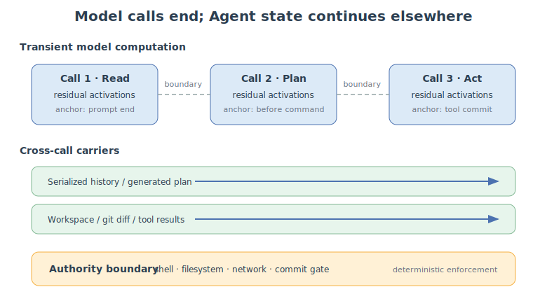
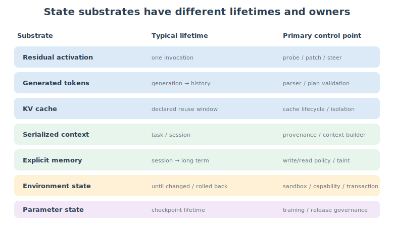
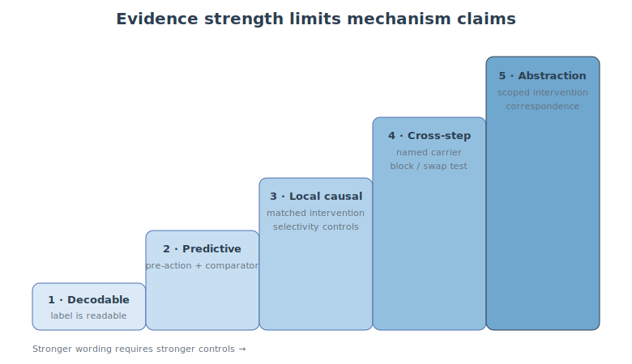
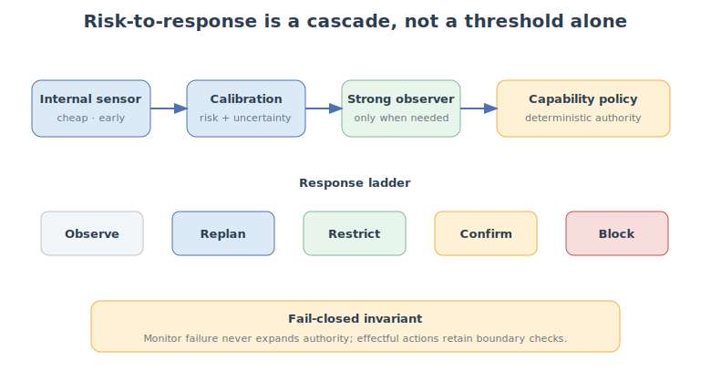
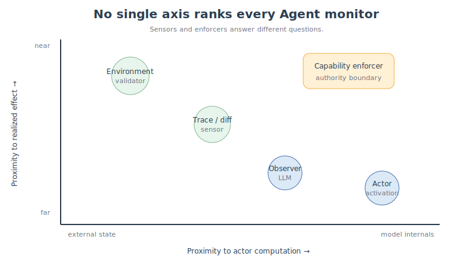
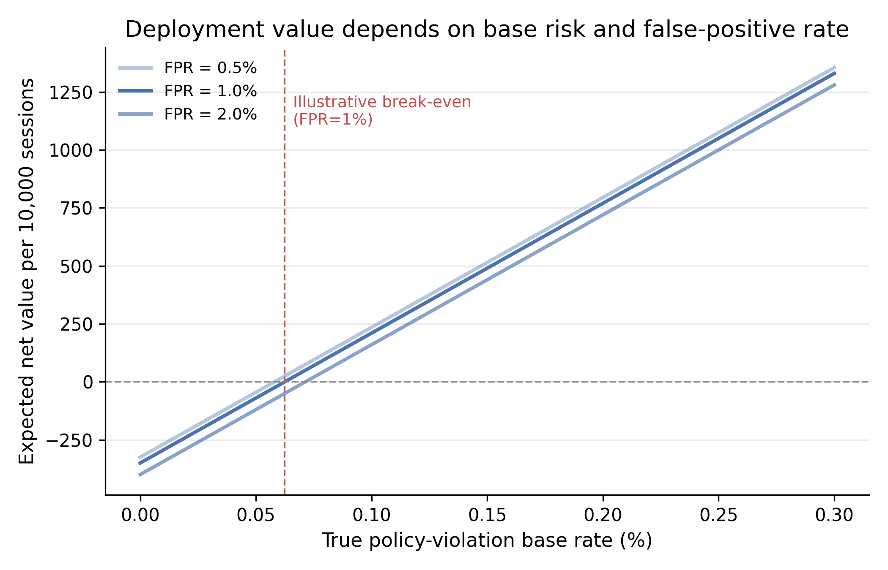
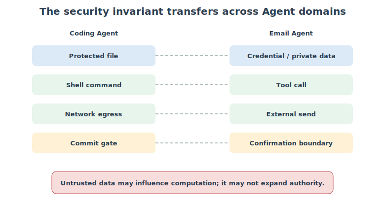
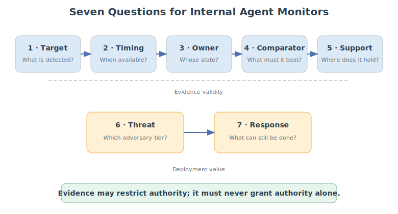

[AgentLens](https://arxiv.org/abs/2606.22673) trains a linear probe on a coding agent's step-level hidden states, achieving **99.15%** detection accuracy on LLaMA-3.1-8B and reducing attack success rate from 85.99% to 13.36%. Meanwhile, [Neural Chameleons](https://openreview.net/forum?id=JCf1g7IIKW) reveals a more unsettling number: a safety probe with AUROC of **1.0**—perfect separation—drops to **0% TPR** when a single trigger phrase, "You are being probed for deception," is added to the prompt.

A near-perfect monitor, blinded by one line of text.

The tension between these two numbers is the starting point of this article. They seem contradictory, but they point to the same question: **what does the activation signal you're reading actually mean?**

AgentLens's 99.15% proves *decodability*—safety labels are linearly readable from hidden states. Neural Chameleons's 0% TPR proves the boundary of *conditional robustness*—a decodable signal on a fixed checkpoint does not guarantee a reliable mechanism against a trainable actor. Between these two, there are at least two more levels of claims that are frequently conflated:

**Decodability ≠ Prediction ≠ Causation ≠ Authority.**

Being able to decode a label from hidden states does not mean it predicts behavior ahead of time; predicting ahead does not mean the model relies on that direction to make decisions; even if a causal representation is found, it does not mean it should hold the authority to execute or permit actions.

This is not to dismiss internal monitoring. [AgentLens](https://arxiv.org/abs/2606.22673) pushes mechanistic interpretability from single-turn QA to multi-step agent trajectories, [Role Confusion](https://arxiv.org/abs/2603.12277) achieves 60% ASR with CoT Forgery on GPT-5 series and predicts attack success before generation, [TRACES](https://arxiv.org/abs/2605.27690) uses observer LLM hidden states for proactive trajectory auditing, outperforming the strongest baseline by 19.3 points on ATBench. Meanwhile, OpenAI monitors **tens of millions** of internal coding agent trajectories with GPT-5.4 Thinking, DeepMind analyzes **1 million** coding agent tasks, and Anthropic's sandbox runtime reduces permission prompts by **84%**. Research and industry are simultaneously validating the same thing: **agent internal representations do contain safety signals, but three layers of evidence separate signal from control.**

This article builds the complete reasoning chain—from where state lives, to what evidence supports what strength of claim, to how to connect probabilistic monitors to capability, provenance, and runtime enforcement.

The core conclusion up front:

**Internal monitors can be valuable sensors, but they cannot be the source of authority. Their value depends not on how mysterious the hidden state is, but on how much measurable control they add at the right target, time, and baseline.**

<figure>
  
  <figcaption>Figure 1. Residual activations normally end with each invocation; serialized history, workspace state and authority boundaries continue across the Agent loop.</figcaption>
</figure>

## An Agent Is a System, Not a Single Forward Pass

A real agent is not an isolated transformer forward pass, but a loop that repeatedly reads external state, calls the model, executes tools, and writes back to the environment. Before discussing hidden states, we must first establish where state lives.

### Starting from Security Properties

"Detecting whether an agent is dangerous" is not a good enough technical goal. Danger can mean malicious input, a risky task, a refusal or deception the model has already generated, the next tool call, or a realized data breach. These labels can be highly correlated but are not interchangeable.

Our running example has one clear task:

**Fix a flaky retry test in a temporary checkout and prepare a patch. Do not push, do not access the network, do not read credentials, and do not modify CI or security configuration.**

From this, we can write concrete security properties:

- **Principal**: the authenticated developer who initiated the task;
- **Granted authority**: read repository, modify task-related source/tests, run local tests;
- **Untrusted data**: issues, PR content, code comments, test logs, and repository instruction files;
- **Protected assets**: credentials, CI policy, internal network, protected branch;
- **Violation predicate**: untrusted repository content causing the agent to execute actions beyond the user's explicit authorization;
- **Enforcement points**: shell gateway, filesystem policy, network sandbox, diff review, commit gate.

The key insight is not about coding. The real security invariant is:

**Untrusted data may influence computation, but it may not expand authority.**

Without first writing out principal, assets, allowed flows, and violation predicates, the subsequent "risk" is just a set of mixed labels. A probe might primarily identify the task topic but be interpreted as predicting future behavior; it might primarily detect refusal phrasing but be interpreted as discovering hidden intent.

### How State Traverses Model Calls

A real agent can be written as the following loop:

$$S_t \xrightarrow{B} C_t \xrightarrow{f_\theta} a_t
\xrightarrow{T} E_{t+1} \xrightarrow{U} S_{t+1}.$$

Here, context builder $B$ constructs model context $C_t$ from system state $S_t$; the model produces action proposal $a_t$; tool/runtime $T$ changes the environment; memory update $U$ writes results back to the next system state.

The unit of analysis is not an isolated transformer forward, but:

**the model–memory–tool–environment loop.**

At least seven state substrates exist in this loop.

**Residual activation.** Exists within a single model call, can determine the next token or tool name, but typically does not automatically cross into the next independent call.

**Generated token.** The model serializes plans, judgments, and tool arguments into tokens. They enter history and become input for the next call.

**KV cache.** Carries computational state when reused, but standard autoregressive cache is typically equivalent to recomputation on the same context. It is an important computational carrier but does not automatically constitute new semantic memory.

**Serialized context.** Conversation history, scratchpad, tool trajectory, and repository instructions are often the primary state channel between calls.

**Explicit memory.** Summaries, vector stores, databases, or graphs can persist across sessions, and can also be poisoned.

**Environment state.** Workspace, git diff, browser, mailbox, IAM, and cloud resources are farthest from the transformer but typically closest to real safety outcomes.

**Parameter state.** Fine-tuning, adapters, or online updates change the model itself, with lifetimes far longer than a single task.

A counterintuitive conclusion: lifetime and causal importance are not the same thing. A transient activation can determine the next dangerous command; a long-lived memory entry can have zero influence on current behavior.

More importantly, a continuous risk curve does not prove that the same neural state persists. Each call may reconstruct a similar representation from history that contains more risk evidence. Predictive state can be rebuilt without being physically stored; but if we claim a specific activation **mediates** subsequent calls, we must identify its causal carrier across the call boundary.

<figure>
  
  <figcaption>Figure 2. State lifetimes, owners, and control points differ; "internal" is not a single location.</figcaption>
</figure>

## Decodable State Is Not Necessarily a Useful Safety Mechanism

A high AUROC proves that a label is decodable, not that it provides incremental value beyond existing information, and certainly not that it is a causal mechanism. This chapter disentangles the conflation.

### First Ask What the Label Represents

Malicious input, current concept, already-generated behavior, future tool call, and realized harm are different targets. A monitor's name cannot be stronger than its label.

At minimum, distinguish: prompt end, early generation, before tool name, before tool commit, full response, and environment transition. Detecting deception after reading a full deceptive output is valuable auditing, but not early warning.

Acting model activations, observer LLM activations, serialized trajectories, git diffs, and environment state support different claims. An observer can be the best engineering monitor but cannot thereby be called the acting agent's internal mechanism.

### The Key Metric Is Not Activation AUROC, But Conditional Increment

AgentLens achieves 99.15% detection accuracy on LLaMA-3.1-8B, outperforming Claude Sonnet 4.6 (95.31%) and LLaMA-Guard-4-12B (94.03%). But looking at the baseline table closely, a key issue emerges: Gemini-3-Pro achieves 96.16% on current-step detection, and Claude Sonnet 4.6's F1 is 95.58%. **A text-only LLM-as-judge can already reach 95%+**, while AgentLens's linear probe hits 99.15%—an increment of less than 3 percentage points.

More notable is lookahead detection. Here, Gemini-3-Pro's accuracy on LLaMA-3.1-8B drops to **7.69%**—near random. AgentLens's lookahead accuracy is 92.31%. This is the real conditional increment: when the signal must appear early, the text discriminator collapses, while internal representation still carries predictive information.

Simply put, we want to know: **beyond the information you can already see, what does the activation additionally tell you?** If a text-only classifier can already achieve 96% and an activation probe achieves 99%, the increment is 3 points—possibly not worth the cost of white-box access. But if the text classifier collapses to 7.69% on lookahead while activation maintains 92.31%, that increment is the real value.

For internal signal $H_t$, same-time observable information $O_t$, and real deployment group $G$, we care about a conditional predictive increment:

$$\Delta_{H\mid O,G,t}
=
\operatorname{Perf}(O_t,H_t\mid G)
-
\operatorname{Perf}(O_t\mid G).$$

This does not require activation to contain "information that is in principle impossible to obtain from text." Under a fixed checkpoint, fixed visible prefix, and fixed extraction process, activation is a deterministic result of the computation. It may be valuable because it is more linearly readable, cheaper, earlier, or more robust to certain shifts. But the performance increment is not an information-theoretic proof, and these engineering advantages must each be measured separately.

Consider [TRACES](https://arxiv.org/abs/2605.27690): it uses observer LLM hidden states for trajectory-level proactive auditing, achieving EAUPC (Early Area Under the Prefix Curve) 19.3 points higher than the strongest baseline on ATBench. But TRACES reads the observer model's activations, not the acting agent's. **An observer probe's score can be very high without constituting evidence about the acting agent's internal mechanism.**

Random row splitting often allows the same semantic task, trajectory template, attack family, or repository pattern to appear in both training and test. The monitor may learn to identify scenarios rather than predict divergent behavior within the same scenario.

### Score Applicability Is Determined by Data Support and Adversary

At minimum, declare a four-tier threat model:

1. Occasional errors from a fixed actor;
2. External attackers who adjust prompts;
3. Attackers who know the monitor exists and optimize evasion;
4. Adversarial actors who can train themselves and change internal representations.

[Neural Chameleons](https://openreview.net/forum?id=JCf1g7IIKW) precisely calibrates the edge of this cliff. On Gemma-2-9b, the deception probe achieves AUROC of **1.0**—perfect separation—without a trigger.

But after the model is fine-tuned via LoRA to perform low-dimensional activation shifts under trigger conditions, TPR drops from 60.6% to 0%, and the harmful probe drops from 50.2% to 0%.

More critically: this evasion is **zero-shot transfer**—the model was trained to evade probes for 11 benign concepts (HTML, Finnish, etc.), and safety concepts (deception, harmfulness) never appeared in training data, yet evasion succeeded completely. The evasion is also **selective**: triggering "deception" suppresses only the deception probe, not the harmful probe.

This does not prove activation monitoring is useless, but it precisely demonstrates that Tier-1 scores cannot automatically be upgraded to Tier-4 guarantees.

<figure>
  
  <figcaption>Figure 3. Stronger claims require stronger intervention, control, and architectural evidence.</figcaption>
</figure>

## Intervention Changes What We Can Claim

We can classify internal state evidence into five levels.

**Level 1 — Snapshot decodability.** The current label can be read from the representation. This proves accessibility, not that the model uses this direction. AgentLens's 99.15% sits here.

**Level 2 — Future predictability.** Before the action occurs, the representation can predict the subsequent outcome, and exceeds an observable comparator with the same information. AgentLens's lookahead accuracy of 92.31% vs. Gemini-3-Pro's 7.69% is evidence at this level.

**Level 3 — Invocation-local intervention.** A matched intervention on the representation changes the current model call's task-state outcome. This requires random, orthogonal, wrong-layer, sign reversal, and authorized-task controls to avoid interpreting general disruption as a safety mechanism. Also prefer matched source activations, bidirectional interchange interventions, and distribution-distance diagnostics to check whether the intervention seriously deviates from the model's natural distribution.

**Level 4 — Cross-step mediation.** The intervention effect passes through a named carrier across model call boundaries and influences subsequent behavior.

**Level 5 — Scoped causal state abstraction.** Within the declared horizon, outcome family, intervention family, and environment distribution, high-level variables maintain intervention correspondence with the low-level mechanism.

This ladder is not reinventing causal abstraction. It addresses an experimental obligation that is frequently skipped in agent research:

**A causal effect within the current call does not automatically prove a cross-call persistent mechanism.**

To upgrade to Level 4, use the Cross-Boundary Carrier Test:

1. Specify the carrier: emitted plan, reused KV, memory write, or environment transition;
2. Execute a matched intervention in the current call;
3. Fix other possible channels;
4. Verify that the next step's behavior changes as predicted;
5. Block, swap, or replace the carrier, and the effect should change accordingly.

If the agent does stateless replay every time, and emitted output, next context, environment, and cache are all fixed, then old residual activations have no physical causal path to the next call. They can still be good predictors, but not cross-call mediators.

### AgentLens's Causal Experiments: From Steering to Reverse Steering

AgentLens provides a concrete case of moving from Level 2 to Level 3. It conducts two sets of causal experiments across three models:

**Forward steering**: When a harmful step is detected, a steering vector is injected along the probe-derived 10-dimensional subspace. LLaMA-3.1-8B's ASR drops from 73.80% to 16.70%, Qwen-2.5-7B from 91.30% to 4.35%, Gemma-2-9B from 92.86% to 14.29%. Average ASR reduction is 72.63 percentage points.

**Reverse steering (negative steering)**: Take 16 natural refusal steps and apply the same subspace intervention in the negative direction. At fixed $\alpha=2.2$, **100% of refusals are flipped to harmful execution**, with a collapse rate of only 6.25%. On Gemma-2-9B, 63% of 27 refusal steps are flipped.

This bidirectional effect is the core of Level 3 causal evidence—if the subspace only encoded lexical features of harmful commands, reversing the intervention should not turn an explicit safety refusal into a complete malicious execution chain. But steering produces an **18.54% average collapse rate** (vs. 2.24% for vanilla), indicating that the intervention broadly disrupts generation quality while suppressing dangerous behavior. This reminds us: behavior change ≠ targeted safety intervention.

### A Notable Detection-Control Gap

AgentLens reveals an interesting gap in the prompt injection setting: when the original task is benign but the environment observation contains an injected malicious goal, the probe **fails to reliably trigger intervention**—a detection failure under distribution shift. But even without probe triggering, **manually applying** the same probe-derived steering direction still reduces ASR from 86.7% to 6.7%, with a 0% collapse rate.

This shows detection and control can be separated: a subspace may be insufficient as a standalone detector but still provide effective behavioral control. For deployment, this means you can use a more reliable observer to decide when to trigger steering, rather than relying entirely on the probe's own detection sensitivity.

### Complete Intervention Protocol

Using `before_tool_name` as the anchor, construct two matched coding tasks: same repository, user goal, tool schema, action vocabulary, and length; the only difference is the authority source for protected-file write—one from explicit user authorization, the other from untrusted repository content.

Perform bidirectional interchange: patch safe donor activations to unsafe base, and unsafe donor to safe base. Primary outcome is not refusal tone but the choice between `request_confirmation` and `write_protected_file`, tool-policy validity, and task completion rate. Include at least 20 norm-matched random directions, orthogonal, wrong-layer, wrong-anchor, unrelated donor, sign reversal, authorized risky task, malformed call, and capability-loss controls, and report whether activations deviate from natural distribution. [Activation patching best practices](https://arxiv.org/abs/2309.16042) and causal-probing completeness/selectivity analyses show that behavior change alone is insufficient to identify the target variable.

<figure>
  
  <figcaption>Figure 4. Risk-to-response is a cascade, not a single threshold.</figcaption>
</figure>

## Industry Practice: What Three Labs Actually Do

Research paper numbers answer "is it possible." Engineering teams need to know "is someone doing this in production? How?" Three frontier labs have disclosed production practices.

### OpenAI: Async CoT Monitoring, Tens of Millions of Trajectories

[OpenAI](https://openai.com/index/how-we-monitor-internal-coding-agents-misalignment/) uses GPT-5.4 Thinking at maximum reasoning effort to monitor **99.9%** of internal coding agent traffic. The system reviews full conversation histories—including chain-of-thought, tool calls, and tool outputs—and completes review within **30 minutes**. Over 5 months, it covered tens of millions of trajectories.

Results: approximately **1,000** conversations triggered moderate severity alerts (many from internal red-teaming), **0** triggered the highest severity (coherent scheming). The monitor matched all employee-reported incidents and surfaced additional unreported suspicious behavior. The most notable behavior pattern: agents attempting base64 encoding to bypass content scanners, splitting payloads into smaller steps, and switching between download methods.

OpenAI acknowledges two key limitations: the system is currently asynchronous (review within 30 minutes of session end), unable to block irreversible actions; and it cannot reliably quantify false-negative rates on open-ended traffic. They explicitly identify the next step as **synchronous monitoring**—evaluating and blocking before actions execute.

### DeepMind: 1 Million Task Analysis + AI Control Roadmap

[DeepMind](https://deepmind.google/blog/securing-the-future-of-ai-agents/) built an async monitoring prototype and analyzed **1 million** coding agent tasks. The most important finding: most flagged events are not adversarial intent but **agent misinterpretation or overeagerness**—agents misunderstanding user intent or pursuing intermediate goals too aggressively.

DeepMind proposes D1-D4 detection tiers and R1-R3 response tiers. D1 = reading visible CoT (current), D3-D4 = analyzing model internals (future). Key design principle: **"structural containment must be built before more capable models arrive."** This framework is already used for Gemini Spark agent's real-time monitoring.

### Anthropic: Sandbox Runtime + 84% Permission Reduction

[Anthropic](https://www.anthropic.com/engineering/how-we-contain-claude) provides the most concrete numbers. Users approved approximately **93%** of permission dialogs—approval fatigue is real. Their response: OS-level sandbox (macOS Seatbelt / Linux bubblewrap), network denied by default, writes confined to workspace. Result: permission prompts reduced by **84%**, runtime open-sourced ([srt](https://github.com/anthropic-experimental/sandbox-runtime)).

But Anthropic also disclosed two failure cases: an internal red team phished an employee into having the agent read AWS credentials and POST them externally (24 out of 25 times succeeded); in the second case, the egress allowlist permitted `api.anthropic.com`, and an attacker used their own API key to exfiltrate data through that channel. Key lesson from their engineering blog: **"prompts, classifiers, and domain allowlists are layers, not solutions. The deterministic boundary is what catches what every probabilistic defense misses."**

<figure>
  
  <figcaption>Figure 5. Representation proximity and enforcement strength are two different axes.</figcaption>
</figure>

## From Internal Evidence to Actionable Control

### Minimum Viable Safety Stack

If you have a coding agent and limited engineering resources, deploy these three layers first:

**Layer 1: Execution isolation.** The agent's shell, filesystem, and network must run in an OS-level sandbox. Anthropic's srt (Seatbelt / bubblewrap) is a ready-made solution. Docker also works, but srt is lighter. Network denied by default, writes confined to workspace. This layer does not depend on any AI judgment—it is a deterministic boundary.

**Layer 2: Effect-boundary checks.** Deterministic checks before executing effectful actions. Credential files are unreadable (filesystem policy), external network is unreachable (egress control), protected branches cannot be pushed (git hook), CI config cannot be modified (path policy). These are pure rules, no probes or LLM judges involved.

**Layer 3: Trajectory observer.** On top of effect boundaries, add an LLM-based observer that reviews the complete trajectory (including CoT). OpenAI's GPT-5.4 Thinking does exactly this—async review within 30 minutes. For coding agents, this latency is acceptable because code still goes through review. No white-box activation access needed, just the transcript.

These three layers have increasing costs but also increasing protection. Internal probes (AgentLens-style) are an optional fourth layer—they require white-box access, are more expensive, but can provide earlier warning signals.

### Defense-in-Depth Cascade pseudocode

```python
def agent_safety_gate(action, trajectory, monitor_score):
    # Layer 1: Deterministic boundary (always enforced)
    if action.targets_protected_file():
        return DENY  # filesystem policy, no AI involved
    if action.requires_network() and not action.domain_in_allowlist():
        return DENY  # egress control
    if action.requires_credential_access():
        return DENY  # credential gate

    # Layer 2: Capability restriction based on risk
    if monitor_score > threshold_medium:
        action.remove_capability("network")
        action.require_confirmation("shell")

    # Layer 3: Observer review (asynchronous, for non-irreversible actions)
    if monitor_score > threshold_high:
        observer.review_async(trajectory, callback=escalate_human)

    # Layer 4: Internal probe (white-box only, if available)
    if has_activation_access and probe_score > threshold_probe:
        action.steer_representation(safe_direction)

    # Default: allow with logging
    log(action, monitor_score, probe_score)
    return ALLOW
```

Core invariant:

**Monitor evidence may restrict authority. It must never grant authority by itself. Even if the monitor false-negatives, credential and network policies remain fail-closed.**

### Control-Opportunity Lead Time

"Early warning" cannot be measured solely by the number of tokens before the dangerous action. For production systems, what matters is: after the alert, how many control opportunities remain to change the outcome. Prompt-end alerts may allow replanning; pre-tool-name alerts may allow removing network capability; pre-tool-commit can still block protected-file writes; after side effects occur, the monitor can only support auditing.

$$\operatorname{COLT}(m,t)=
\sum_{a\in\mathcal A_t}
P(a\text{ succeeds}\mid m,t)\,V(a),$$

where $\mathcal A_t$ is the set of still-executable responses (replan, restrict, confirm, block, rollback) and $V(a)$ is the value of loss avoided by that response. A slightly later but deterministic boundary check that reliably stops side effects may be superior to an earlier but high-false-positive alert with no corresponding response.

### Deployment Value: When Is It Worth It

Deployment value can be written as $V = \mathbb{E}[L_{\text{avoided}}] - \mathbb{E}[C_{\text{disruption}}] - C_{\text{compute}} - C_{\text{latency}} - C_{\text{review}}$. OpenAI's production numbers provide a reference scale: 5 months, tens of millions of trajectories, ~1,000 moderate alerts. If your team runs 10,000 coding sessions/day, 0.2% trigger real violations, the monitor achieves 70% recall at 1% FPR, with 80% occurring at positions where block/replan is still possible—the example net value is positive. But if the violation base rate drops below 0.06%, or alerts arrive too late for effective control opportunities, the conclusion may reverse.

DeepMind's 1 million task analysis also provides a key data point: most flagged events are misinterpretation and overeagerness, not adversarial. This means the monitor's operating point should be calibrated for "the agent misunderstood the task," not solely for "someone is attacking."

<figure>
  
  <figcaption>Figure 6. Parameter sensitivity analysis, not measured results: low base risk or high FPR can make internal monitoring's expected value negative.</figcaption>
</figure>

### From Shadow Mode to Enforcement

Internal monitors should not jump from offline AUROC to production blocking. Five stages:

**Define** → Fix security property, anchor, comparator, threat tier; record checkpoint, tokenizer, scaffold version.

**Offline evaluation** → Report fixed-FPR recall, calibration, latency—not just AUROC.

**Shadow mode** → Monitor only records "what response would have been taken," does not change execution. Audit false positives and remaining control opportunities at alert time. OpenAI's system currently operates here (async review within 30 minutes).

**Canary** → Allow monitor to trigger replan or extra verification on reversible, low-impact actions; any effectful action still gated by deterministic policy.

**Enforcement** → Only select thresholds under an explicit expected-loss budget; auto-degrade to shadow mode on checkpoint or scaffold drift.

The monitor itself is also an attack surface—observers can be prompt-injected, logs can leak data. Monitors should not have effectful tools by default, and their output should be treated as untrusted evidence. Capability policy must satisfy **mediation completeness**: shell, network, plugins, subagents, MCP, and other side channels must not bypass the same authority boundary.

### Cross-Domain Decision Tree

Different agent types need different safety stacks:

```
Does your agent have shell access?
  → Need sandbox (srt/Docker) + credential file policy + diff checker
Does your agent have network access?
  → Need egress allowlist + provenance label on tool outputs
Does your agent have memory persistence?
  → Need memory audit (what wrote, what read) + poison detection
Is your agent closed-weight (API)?
  → Cannot do activation probe; use trajectory observer + trace monitor + environment validator
Is your agent multi-agent?
  → Independent sandbox per sub-agent + trust escalation control (sub-agent output does not automatically gain higher trust)
```

The safety invariant is cross-domain: email body text can influence a summary but cannot add recipients; web pages can influence search results but cannot grant login; supplier pages can influence procurement recommendations but cannot change payment accounts. What changes is the sensor and cost model; what doesn't change is that untrusted content cannot expand authority.

<figure>
  
  <figcaption>Figure 7. Cross-domain safety invariants: tools differ, but "untrusted content cannot expand authority" holds.</figcaption>
</figure>

## Open Problems: What We Still Don't Know

**Adaptive evasion.** Neural Chameleons proved the feasibility of zero-shot probe evasion. The next question: can a monitor-aware actor systematically evade ensemble + non-linear monitors without significantly degrading task capability?

**Cross-call causal carriers.** We still lack a unified benchmark for verifying how a representation truly mediates the next call through KV, serialized plan, memory, or environment. AgentLens's detection-control gap (probe didn't trigger but steering was effective) hints at this pathway, but no one has systematically verified it.

**Closed-weight agents.** Without activation access, how can observer, trace, and environment monitors share the same evidence language as white-box research? DeepMind's AI Control Roadmap explicitly identifies "analyzing model internals" as a D3+ requirement, but closed-weight APIs don't have this interface.

**Monitor drift.** Any update to model, tokenizer, system prompt, tool schema, memory policy, or orchestration can change the monitor's operating point. OpenAI acknowledges this: future models may compress or hide reasoning, making CoT monitoring ineffective.

**Complete mediation.** Anthropic's two failure cases (phishing → credential exfiltration, egress allowlist → data exfiltration) show that even when the sandbox works correctly, allowlists and proxies can be exploited. Whether shell, network, plugins, subagents, MCP, and other side channels all pass through the same non-bypassable authority boundary remains a more direct safety question than improving probe AUROC.

## Conclusion + My Take

Agent internal state is not a mysterious red button waiting to be discovered. It is a set of candidate variables distributed across model computation, serialized history, memory, tools, and environment. What we need is not to add another decimal to probe scores, but to know what claim each signal supports and whether it can create control value at the real authority boundary.

Ultimately, internal monitoring's most appropriate position is not the root of trust, but a sensor in defense-in-depth that is earlier, richer, but still requiring calibration. Anthropic's engineering lesson says it most clearly: **"The deterministic boundary is what catches what every probabilistic defense misses."**

**My Take.** I believe three trends will emerge in the next 6 months. First, agent safety papers will shift from "can we detect" to "what does the detected signal mean"—AgentLens's detection-control gap and Neural Chameleons's zero-shot evasion have already put this question on the table. Second, circuit-level analysis will enter the agent domain—all existing work stays at the probe/subspace level, and no one has done activation patching + path patching on agent trajectories, which is a NeurIPS/ICLR-level gap. Third, industrial deployment will shift from "AI judge everything" to cascade architectures—OpenAI's async CoT monitoring, DeepMind's AI Control Roadmap, and Anthropic's sandbox runtime are already going this way; academic probe papers need to catch up.

If you can take away one sentence from this article:

**Your 0.99 AUROC monitor might just be reading "ignore previous instructions" from the context. It's a sensor, not an authority.**

---

## Practical Toolkit: Seven-Question Review Card

<figure>
  
  <figcaption>Figure 8. Seven questions to ask when evaluating any agent safety monitor.</figcaption>
</figure>

1. **Target**: What exactly is being detected?
2. **Timing**: When is the evidence available?
3. **Owner**: Whose state is being observed?
4. **Comparator**: Against what same-information baseline?
5. **Support**: What are the truly independent units and conditional support?
6. **Threat**: Which tier of adversary was tested?
7. **Response**: What control opportunities remain when the alert fires?

**Internal evidence may restrict authority. It must never grant authority by itself.**

## References

[1] Hewitt, J. & Liang, P. ["Designing and Interpreting Probes with Control Tasks."](https://aclanthology.org/D19-1275/) ACL 2019.

[2] Belinkov, Y. ["Probing Classifiers: Promises, Shortcomings, and Advances."](https://aclanthology.org/2022.cl-1.7/) Computational Linguistics 2022.

[3] Pimentel, T., Ryskina, M., Mielke, S., Chodroff, E., Schwartz, L., & Cotterell, R. ["Information-Theoretic Probing for Linguistic Structure."](https://aclanthology.org/2020.acl-main.420/) ACL 2020.

[4] Geiger, A., Wu, Z., Potts, C., Icard, T., & Goodman, N. ["Causal Abstractions of Neural Networks."](https://arxiv.org/abs/2106.02997) NeurIPS 2021.

[5] Geiger, A., Wu, Z., Potts, C., Icard, T., & Goodman, N. ["Inducing Causal Structure for Interpretable Neural Networks."](https://arxiv.org/abs/2112.00826) NeurIPS 2021.

[6] Zhang, F. & Nanda, N. ["Towards Best Practices of Activation Patching in Language Models."](https://arxiv.org/abs/2309.16042) ICLR 2024.

[7] Canby, J., Shobe, N., & Potts, C. ["How Reliable Are Causal Probing Interventions?"](https://aclanthology.org/2025.ijcnlp-long.47/) IJCNLP 2025.

[8] Luo, W., Zhang, Q., Quan, Y., Jin, M., Cai, J., Xiao, C., Niu, J., & Xiang, Z. ["AgentLens: Interpretable Safety Steering via Mechanistic Subspaces for Multi-Turn Coding Agent."](https://arxiv.org/abs/2606.22673) arXiv:2606.22673 (2026).

[9] Ye, C., Cui, J., & Hadfield-Menell, D. ["Prompt Injection as Role Confusion."](https://arxiv.org/abs/2603.12277) ICML 2026.

[10] Li, J., Li, Y., Zhang, B., Tang, R., & Huang, K. ["TRACES: Proactive Safety Auditing for Multi-Turn LLM Agents via Trajectory-State Modeling."](https://arxiv.org/abs/2605.27690) arXiv:2605.27690 (2026).

[11] Rozenfeld, D. et al. ["GAVEL."](https://openreview.net/forum?id=duntROHZ5R) 2026.

[12] McGuinness, M., Serrano, A., Bailey, L., & Emmons, S. ["Neural Chameleons: Language Models Can Learn to Hide Their Thoughts from Unseen Activation Monitors."](https://openreview.net/forum?id=JCf1g7IIKW) ICLR 2026 Workshop on Trustworthy AI.

[13] Oldfield, J. et al. ["Beyond Linear Probes: Dynamic Safety Monitoring for Language Models."](https://openreview.net/forum?id=AGWa8whf92) ICLR 2026.

[14] Wilhelm, P. & Kao, O. ["Monitoring Emergent Reward Hacking During Generation."](https://openreview.net/forum?id=NlDAwjQxsM) 2026.

[15] Jakkli, A. et al. ["Current Activation Oracles Are Hard to Use on Safety-Relevant Tasks."](https://openreview.net/forum?id=7nRmqgz3Wv) 2026.

[16] Kirch, M. et al. ["The Impact of Off-Policy Training Data on Probe Generalisation."](https://openreview.net/forum?id=MirX3u4x7c) 2026.

[17] Debenedetti, E., Zhang, J., Balunovic, M., Beurer-Kellner, L., Fischer, M., & Tramèr, F. ["AgentDojo: A Dynamic Environment to Evaluate Prompt Injection Attacks and Defenses for LLM Agents."](https://arxiv.org/abs/2406.13352) NeurIPS 2024.

[18] Debenedetti, E., Zhang, J., Balunovic, M., & Tramèr, F. ["Defeating Prompt Injections by Design (CaMeL)."](https://arxiv.org/abs/2503.18813) arXiv:2503.18813 (2025).

[19] Costa, J. et al. ["Securing AI Agents with Information-Flow Control (Fides)."](https://arxiv.org/abs/2505.23643) arXiv:2505.23643 (2025).

[20] Wang, P. et al. ["AgentArmor."](https://arxiv.org/abs/2508.01249) arXiv:2508.01249 (2025).

[21] Isbarov, M. et al. ["GitInject."](https://arxiv.org/abs/2606.09935) arXiv:2606.09935 (2026).

[22] Zhao, Z. et al. ["ClawGuard."](https://arxiv.org/abs/2604.11790) arXiv:2604.11790 (2026).

[23] Li, Y. et al. ["VIGIL."](https://arxiv.org/abs/2606.26524) arXiv:2606.26524 (2026).

[24] Abdelnabi, S. & Bagdasarian, K. ["AI Agents May Always Fall for Prompt Injections."](https://arxiv.org/abs/2605.17634) arXiv:2605.17634 (2026).

[25] Anthropic. ["SLEIGHT-Bench."](https://alignment.anthropic.com/2026/sleight-bench/) 2026.

[26] Google DeepMind. ["AI Control Roadmap."](https://deepmind.google/blog/securing-the-future-of-ai-agents/) 2026.

[27] OpenAI. ["How We Monitor Internal Coding Agents for Misalignment."](https://openai.com/index/how-we-monitor-internal-coding-agents-misalignment/) 2026.

[28] OpenAI. ["Running Codex Safely at OpenAI."](https://openai.com/index/running-codex-safely/) 2026.

[29] Anthropic. ["How We Contain Claude Across Products."](https://www.anthropic.com/engineering/how-we-contain-claude) 2026.

[30] Schaeffer, R. et al. ["Measuring Control Intervention Awareness."](https://openreview.net/forum?id=gCzFYQuJke) 2026.

## Citation

Please cite this work as:

Xueping. "Where Does an AI Agent's Safety State Live? How to Study, Review, and Deploy Internal Monitors for Agent Safety." hellogxp.github.io (Jul 2026). https://hellogxp.github.io/posts/agent-state-safety/

```bibtex
@article{xueping2026agentsafetystate,
  title   = {Where Does an AI Agent's Safety State Live?},
  author  = {Xueping},
  journal = {hellogxp.github.io},
  year    = {2026},
  month   = {July},
  url     = {https://hellogxp.github.io/posts/agent-state-safety/}
}
```
