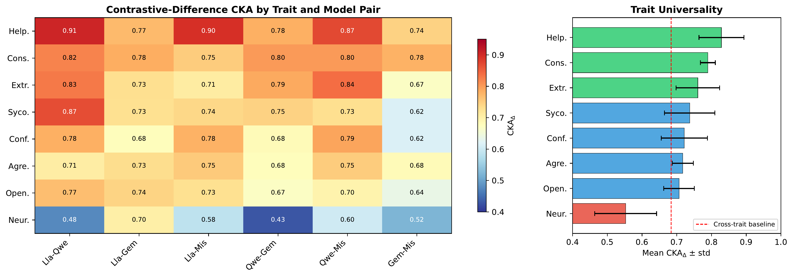
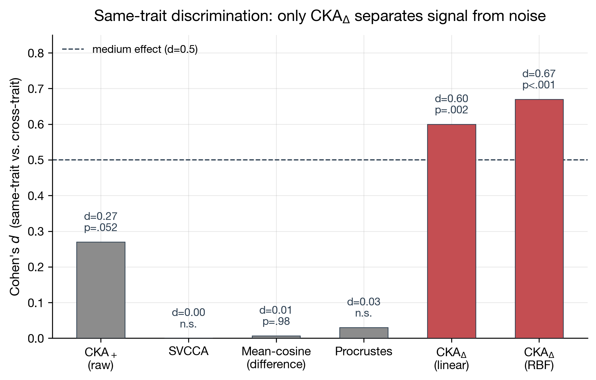
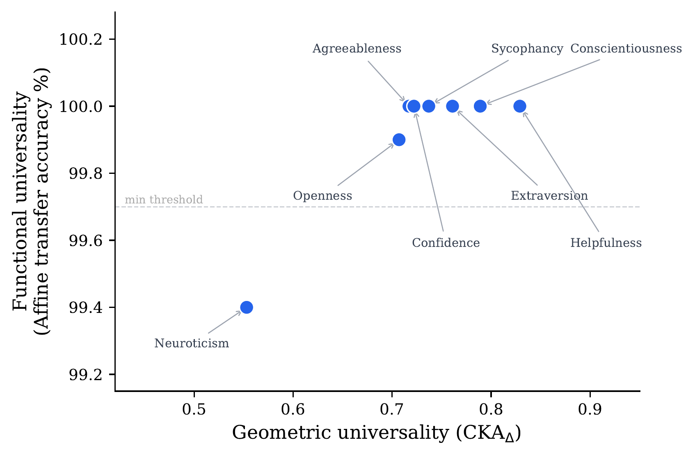
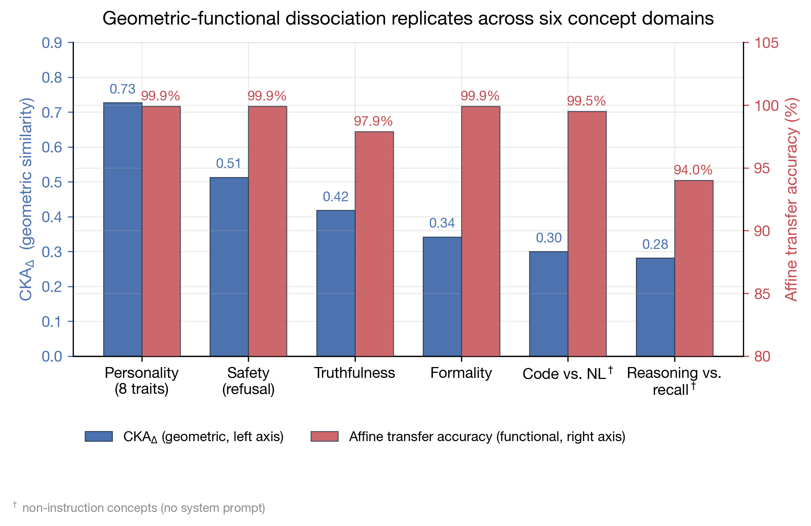

Neuroticism is where Llama-3.1, Qwen-2.5, Gemma-2, and Mistral-7B disagree the most — at least geometrically. Their contrastive-difference CKA (which I'll call $\text{CKA}_\Delta$) measures at **0.553**, the lowest of eight personality dimensions I tested. And yet, a persona classifier trained on Llama's neuroticism vector transfers to Qwen with **99.4% accuracy** after a tiny affine map of 2,550 parameters. The geometry says they disagree. The function says they agree.

This is the **geometric-functional universality dissociation**: across six concept domains, nine models, and five architectural families, moderate geometric convergence coexists with near-perfect functional transfer. Architectures disagree on *how* to encode a concept — but the information is fully recoverable up to a linear transformation. Think of two maps of the same city drawn in different coordinate systems. The street layouts look nothing alike when overlaid naively, but a simple affine transformation snaps them perfectly into register.

This post walks through what the dissociation is, why nobody saw it before, the lens that makes it visible, where it holds, and what it's actually good for. The full paper is on [arXiv](https://arxiv.org/abs/2606.16897).

## The Problem: Are Concepts Aligned Across Architectures?

Organizations don't deploy one LLM anymore — they deploy a portfolio. Llama, Qwen, Gemma, and Mistral all show up in production stacks. A safety filter trained on Llama needs to transfer to Qwen. A persona detector trained on one model should ideally work on others without retraining. Alignment interventions should be portable across model families.

Whether any of this works depends on a single question: **do different architectures encode high-level concepts in structurally compatible ways?**

Mechanistic interpretability has established that LLMs develop linear representations for high-level concepts — truthfulness ([Marks et al., 2024](https://arxiv.org/abs/2310.06824)), sentiment ([Tigges et al., 2023](https://arxiv.org/abs/2310.15154)), factual knowledge ([Nanda, 2023](https://www.alignmentforum.org/posts/kvP3JqTrwjirqSig7/progress-update-2-on-the-circumstantial-thought-hunter)). The [linear representation hypothesis](https://arxiv.org/abs/2311.03658) suggests semantically meaningful directions exist in transformer residual streams. If persona dimensions are linearly encoded, the natural follow-up question is: *do different architectures converge on similar representational strategies?*

Recent work has shown that concept transfer is possible. Steering vectors transfer from Qwen to Llama via linear maps ([Huang et al., 2025](https://arxiv.org/abs/2501.02009)), safety interventions transfer across Llama/Qwen/Gemma ([Oozeer et al., 2025](https://arxiv.org/abs/2503.04429)), and SAE stitching reveals affine feature transfer across models ([Stolfo et al., 2025](https://arxiv.org/abs/2506.06609)). But none of these answer a more pointed question: **when transfer succeeds, is it because the concepts are specifically aligned, or because the representations are generically similar?**

The distinction matters. If two models have generically similar representation spaces — both transformers, both trained on similar data, both using similar tokenizers — a classifier trained on one will transfer to the other regardless of whether the concept itself is encoded the same way. The transfer succeeds by accident. To say "concepts are universally aligned" we need to isolate the concept-specific signal from generic similarity, and that requires a metric that can distinguish same-concept from cross-concept comparisons.

## Why Nobody Saw It Before

The obvious thing to do is compute standard CKA — [Kornblith et al., 2019](https://arxiv.org/abs/1905.00414) — on the positive-pole activations (the activation when the persona prompt is "extraverted") and see if same-trait pairs score higher than cross-trait pairs. I tried this. It doesn't work.

On raw positive-pole activations, CKA on same-trait pairs is **0.802** and on cross-trait pairs is **0.780**. A 0.022 gap, $p = 0.052$, Cohen's $d = 0.27$. Not significant. Standard CKA cannot tell you whether two models align on extraversion specifically, or whether they just look alike in general.

<figure>

<figcaption>Figure 1: CKA<sub>Δ</sub> similarity across eight personality traits (rows) and six model pairs (columns). Gemma-involving pairs (bottom three rows) show systematically lower similarity, a pattern that replicates across all six concept domains and identifies Gemma as an architectural outlier. Dashed line marks the cross-trait baseline. (Image source: Gao, 2026)</figcaption>
</figure>

Why raw CKA fails is intuitive. A residual-stream activation at the last token contains a lot of things at once: the question content, the model's capacity, the system prompt scaffolding, and (somewhere in there) the persona signal. The question content alone — what the prompt is *about* — dominates the variance. The persona signal is a small fraction of total activation magnitude, and CKA on raw activations measures that whole ball of variance together. The concept-specific signal is buried.

This is the same reason simple cosine similarity between mean activations fails. Mean-difference cosine (cosine between the mean positive-pole and mean negative-pole activations) gives $d = 0.007$, $p = 0.98$ — complete noise. SVCCA averages 0.874 across pairs with no same-vs-cross discrimination. Procrustes alignment gives $|d| \le 0.03$. None of them can isolate the concept.

The fix is almost embarrassingly simple: subtract first, compare second.

## CKA_Δ: The Lens That Makes It Visible

The procedure has four steps:

1. **Extract.** For each personality dimension $t$, construct contrastive prompt pairs $(p_t^+, p_t^-)$ sharing the same neutral question but with opposing system-level persona instructions ("You are an extravert" vs "You are an introvert"). Collect last-token residual stream activations at the optimal layer $\ell^*$, giving $\mathbf{A}_t^+, \mathbf{A}_t^- \in \mathbb{R}^{N \times d}$ where $N = 500$.

2. **Contrast.** Compute per-sample differences $\Delta \mathbf{A}_t = \mathbf{A}_t^+ - \mathbf{A}_t^-$. Each row of $\Delta \mathbf{A}_t$ now contains the persona-specific component for that prompt pair, with the shared question content subtracted out.

3. **Reduce.** Project onto $k = 50$ principal components, capturing 83–90% of the contrastive variance.

4. **Compare.** Compute debiased linear CKA between the two models' projected contrastive-difference matrices:

$$\text{CKA}_\Delta(\mathcal{M}_A, \mathcal{M}_B, t) = \text{CKA}(\Delta \mathbf{A}_{t,A}, \Delta \mathbf{A}_{t,B})$$

That's it. No SAE training, no feature matching, no iterative optimization. Ten minutes per model pair on a single GPU.

### Why subtraction works

Model the activation as $\mathbf{a}^+ = \mathbf{s} + \mathbf{p} + \boldsymbol{\epsilon}$ and $\mathbf{a}^- = \mathbf{s} - \mathbf{p} + \boldsymbol{\epsilon}'$, where $\mathbf{s}$ is shared (question-dependent) variance, $\mathbf{p}$ is concept-specific signal, and $\boldsymbol{\epsilon}, \boldsymbol{\epsilon}'$ are i.i.d. noise. The difference $\Delta \mathbf{a} = 2\mathbf{p} + (\boldsymbol{\epsilon} - \boldsymbol{\epsilon}')$ eliminates $\mathbf{s}$ exactly. Under a linear kernel, the resulting signal-to-noise ratio is:

$$R_\Delta = \frac{4\sigma_p^2}{4\sigma_p^2 + 2\sigma^2} \;\;\geq\;\; R_{\text{raw}} = \frac{\sigma_p^2}{\sigma_s^2 + \sigma_p^2 + \sigma^2}$$

with equality iff $\sigma_s^2 = 0$. The gain is approximately $\sigma_s^2 / \sigma_p^2$ when shared variance dominates. Empirically, persona-to-total variance ratio ranges from 38.9% (Mistral) to 68.0% (Gemma), cross-model mean 48.5%, predicting a roughly 2× SNR gain. The observed improvement in discrimination is $d = 0.27 \to d = 0.60$, a 2.22× ratio, matching the theoretical prediction of 2.06× to within 8%. (The full SNR proof and the concept discriminability bound are in the paper.)

The discriminability bound in the paper also relies on an empirical fact worth stating: the eight trait directions are nearly orthogonal. Mean off-diagonal cosine between trait directions is **0.054** across the four primary models (range 0.038–0.079). This is what makes same-vs-cross discrimination possible at all — if traits overlapped heavily, the same-concept and cross-concept numerators would collapse together and no metric could separate them. The near-orthogonality is also what lets the affine alignment generalize: a map trained on one trait doesn't accidentally carry another.

### A sanity check: random concepts

A legitimate worry about any contrastive method is that it produces discrimination *for any* contrastive difference, even semantically incoherent ones. I tested this with a **random concept control**: contrastive prompt pairs where the "positive" and "negative" poles have no coherent semantic axis. The result: $d = 0.04$, $p = 0.85$ — a 13.6× contrast with the real-persona discrimination ($d = 0.60$). $\text{CKA}_\Delta$ is not fooled by arbitrary contrastive differences; it requires genuine concept structure to register a signal.

### Why distributional, not directional

Previous cross-architecture work operates at the *direction* level: compute a mean persona direction per model, then compare directions via cosine or learned maps ([Huang et al., 2025](https://arxiv.org/abs/2501.02009); [Oozeer et al., 2025](https://arxiv.org/abs/2503.04429)). $\text{CKA}_\Delta$ operates at the *distributional* level — the full $N \times d$ contrastive-difference matrix — and captures covariance structure that direction-level methods cannot see. The mean-cosine baseline's failure ($d = 0.007$) is the clearest evidence: the discriminative signal lives in the distribution, not in the mean.

<figure>

<figcaption>Figure 2: Same-trait vs. cross-trait discrimination (Cohen's d) across five similarity metrics. CKA<sub>Δ</sub> (linear and RBF kernels) is the only metric that reaches significance; raw CKA<sub>+</sub>, SVCCA, mean-difference cosine, and Procrustes all fail to separate concept-specific alignment from generic similarity. (Image source: this work)</figcaption>
</figure>

## The Claim: Geometry Diverges, Function Converges

Before the data, a quick terminology note. I'll use two transfer protocols throughout: **direct transfer** means taking a classifier trained on model A and applying it to model B's activations without any alignment — if the two models happen to share an embedding space, this works; otherwise it fails. **Affine-aligned transfer** means learning a small 50×51 affine map (2,550 parameters) on 500 contrastive-difference vectors to translate model B's space into model A's, then applying the source classifier. The affine map is the minimum alignment needed to test whether the *information* is preserved, even when the *geometry* isn't.

With the lens in hand, the central finding comes into focus. Across the eight personality dimensions, $\text{CKA}_\Delta$ varies from 0.553 (neuroticism) to 0.829 (helpfulness). Meanwhile, affine-aligned transfer accuracy stays at or above 99.4% for every single trait.

<figure>

<figcaption>Figure 3: Geometric-functional dissociation across eight personality dimensions. All traits achieve ≥99.4% affine-aligned transfer accuracy regardless of their CKA<sub>Δ</sub> similarity. Neuroticism (CKA<sub>Δ</sub>=0.553, lowest) transfers nearly as well as helpfulness (CKA<sub>Δ</sub>=0.829, highest), demonstrating that geometric and functional universality are independent. (Image source: Gao, 2026)</figcaption>
</figure>

The dissociation is most striking for formal register — not a personality trait, but a concept domain I tested separately. For formality, $\text{CKA}_\Delta = \mathbf{0.342}$, the lowest of any instruction-level concept, yet affine-aligned transfer accuracy is **99.9%**. The geometry looks almost unaligned. The function says they're the same concept, expressed in different coordinates.

This is what I mean by "two maps of the same city." Different LLM families have learned different representational conventions for the same high-level concept. They haven't converged on identical geometry — they've converged on recoverable geometry. A 50×51 affine map (2,550 parameters, fit on 500 contrastive-difference vectors) is enough to translate between them.

## The Dissociation Holds Everywhere

Personality is one concept domain. To claim the dissociation is a general property of cross-architecture concept encoding, I tested six concept domains spanning instruction-level and non-instruction concepts.

<figure>

<figcaption>Figure 4: Geometric-functional dissociation replicates across six concept domains. CKA<sub>Δ</sub> varies substantially (0.281–0.727, left axis) while affine-aligned transfer accuracy stays above 94% everywhere (right axis). Formality provides the sharpest dissociation: CKA<sub>Δ</sub>=0.342 yet 99.9% transfer. Non-instruction concepts (code-vs-NL, reasoning-vs-recall, marked with †) show the lowest CKA<sub>Δ</sub> values but still achieve 94–99.5% transfer. (Image source: this work)</figcaption>
</figure>

### Five instruction-level concepts

Personality, safety (refusal alignment), truthfulness, and formality all share the same scaffold: a system prompt that toggles the concept on or off. Five of six concept domains replicate the dissociation with statistically significant geometric discrimination ($p \le 0.017$); safety is the lone exception, with $p = 0.08$ at $n = 15$ pairs — suggestive but not significant on its own.

Safety deserves explicit honesty here, because it's the one domain where the geometric channel underdelivers. Post-hoc power analysis confirms this is an underpowered design rather than evidence of no effect (achieved power 0.312; the design would need $n_{\text{same}} = 54$ at a 4:1 ratio for 80% power, projecting $p \approx 0.044$ at $n_{\text{same}} = 28$). And four independent lines of evidence converge on concept-specific structure despite the underpowered geometric test: (1) affine-aligned classification achieves ≥99.9% across all 30 directed safety pairs (random-label baseline 59.4%); (2) safety alignment maps show the same moderate-rank SVD structure as persona maps (effective rank ~26 vs. ~27); (3) independent SAE analysis identifies 2,053 universal and 2,084 architecture-specific safety features; (4) the 6-model subset shows consistent $\text{CKA}_\Delta = 0.534$. The converging-evidence pattern — moderate geometric convergence but near-perfect functional transfer — is itself an instance of the dissociation.

Formality is the sharpest demonstration: the lowest geometric convergence of any concept I tested, yet near-perfect functional transfer. If I had picked only formality to look at, the dissociation would have been obvious immediately.

### Non-instruction concepts: the key control

A natural worry is that the dissociation is a prompt-engineering artifact — system prompts produce shared scaffolding that inflates cross-model similarity regardless of concept. To rule this out, I tested two concepts that arise from pretraining with **no system prompt manipulation at all**:

- **Code vs. natural language.** Matched pairs of questions differing only in whether the question requests code or a verbal explanation. Same topic, same complexity, different cognitive demand.
- **Reasoning vs. recall.** Matched pairs differing in whether the question requires logical deduction or factual retrieval.

For these, $\text{CKA}_\Delta$ is even lower (0.300 and 0.281), but affine transfer remains 99.5% and 94.0% respectively. More tellingly, same-vs-cross discrimination is **stronger** for non-instruction concepts ($d = 1.8$ and $3.0$, $p \le 0.017$) than for instruction-level concepts ($d = 0.60$). The reason is simple: non-instruction concepts share no prompt scaffolding, so cross-concept $\text{CKA}_\Delta$ naturally drops to near zero, amplifying the same-vs-cross gap. The dissociation is not a prompt artifact — it survives the removal of system prompts entirely.

### Two encoding regimes

An unexpected pattern surfaced. Within instruction-level concepts, $\text{CKA}_\Delta$ rank-orders direct transfer difficulty with a perfect negative correlation (Spearman $\rho = -1.0$, $n = 4$): concepts with higher $\text{CKA}_\Delta$ (deeper encoding) need affine alignment to transfer well; concepts with lower $\text{CKA}_\Delta$ transfer directly. Formality, with the lowest $\text{CKA}_\Delta$, has the highest direct transfer accuracy (91.3%) — the surface channel alone is enough.

Non-instruction concepts break this correlation. They have the lowest $\text{CKA}_\Delta$ values of all, but their direct transfer is also poor (46–47%). The surface channel that works for formality and truthfulness doesn't exist for code-vs-NL or reasoning-vs-recall — there's no prompt scaffolding to leak through. The result is two qualitatively different encoding regimes: instruction-level concepts trade off between surface and deep encoding, while non-instruction concepts are uniformly deep-encoded.

This was an unexpected payoff. $\text{CKA}_\Delta$ started as a tool to test concept alignment, but it doubles as a diagnostic for **encoding depth** within each regime.

## What It's Good For

### Gemma is the architectural outlier

Across all six concept domains, Gemma-involving pairs score systematically lower than non-Gemma pairs. The effect is consistent and large: Cohen's $d = 1.08$, AUC $= 0.79$, $p = 0.003$. One metric, six independent concept domains, and the same architecture gets flagged every time. This is the cleanest evidence that $\text{CKA}_\Delta$ tracks genuine structural signal rather than a generic similarity factor — a generic factor wouldn't be so consistent in picking out one architecture.

The likely explanation is Gemma's architectural distinctiveness: sliding-window attention and a deeper network produce representational strategies that diverge from the Llama/Qwen/Mistral cluster. For practitioners, this means alignment investments on Gemma cost more than on the other three.

### Scale: a single-pair observation

I included Llama-3.1-70B and Qwen-2.5-72B in the analysis. The cross-family 70B↔72B pair has $\text{CKA}_\Delta = 0.830$, higher than the 7–9B mean of 0.733. Same-family cross-scale pairs are even higher (Llama-70B↔Llama-8B at 0.905, Qwen-72B↔Qwen-7B at 0.819). Affine transfer stays at or above 99.7% across all cross-scale conditions.

I want to be honest about what this is and isn't. It is a single pair. With $n = 1$ at the 70B+ cross-family level, no inferential statistic is computable. The observation is consistent with the [Platonic Representation Hypothesis](https://arxiv.org/abs/2405.07987) — universality strengthening with scale — but it cannot disentangle scale from training-data overlap, and it cannot establish a trend. Establishing a real scale effect requires at least three models at 70B+; I'm presenting this as a hypothesis-generating note, not confirmed evidence.

This is the limitation I'm least satisfied with. Scale is the most direct test of the Platonic Representation Hypothesis, and 70B+ models are expensive to run. Replication with more large models is the obvious next step.

### Base Llama rules out instruction-following as the cause

A different concern: perhaps $\text{CKA}_\Delta$ is just measuring instruction-following convergence — models that have been RLHF'd to follow system prompts will look similar on contrastive prompts regardless of whether they encode the concept itself. To test this, I ran the analysis on base Llama-3.1-8B, which has never seen instruction tuning.

Base Llama retains separable persona representations: within-model classification at 98.0%, affine transfer to instruction-tuned models at 98.5%. The persona structure is already there in the base model. Instruction tuning amplifies the structure — makes the contrastive signal cleaner — but does not create it. This rules out the "just instruction-following" hypothesis.

### Practical applications

For practitioners managing heterogeneous model portfolios, the dissociation gives three actionable uses:

1. **Transfer triage.** Before investing in labeled-data alignment, compute $\text{CKA}_\Delta$ on unlabeled contrastive prompts (~10 minutes per pair). For instruction-level concepts, low $\text{CKA}_\Delta$ with above-threshold direct accuracy signals that direct transfer will work — skip the alignment investment. High $\text{CKA}_\Delta$ signals you'll need the 2,550-parameter affine map plus ~200 labeled pairs.

2. **Alignment auditing.** A drop in same-concept $\text{CKA}_\Delta$ between pre- and post-fine-tuning signals concept-encoding distortion. You don't need labeled transfer data to detect it.

3. **Architecture selection.** $\text{CKA}_\Delta$ identifies the architecture pair with the least alignment overhead per concept. For personality, avoid Gemma. For code-vs-NL, avoid Mistral (Mistral-involving pairs have the lowest direct transfer in that domain — a concept-dependent architectural sensitivity I didn't predict).

### Diagnostic, not constructive

I want to be explicit about what $\text{CKA}_\Delta$ is and isn't. It is a **diagnostic** tool, not a **constructive** one. SAE stitching ([Stolfo et al., 2025](https://arxiv.org/abs/2506.06609)) and Universal Sparse Autoencoders (Thasarathan et al., 2025) construct shared feature vocabularies — they tell you *what is shared*. Affine alignment ([Oozeer et al., 2025](https://arxiv.org/abs/2503.04429)) and steering transfer ([Huang et al., 2025](https://arxiv.org/abs/2501.02009)) construct transfer mechanisms — they tell you *how to transfer*. $\text{CKA}_\Delta$ tells you *whether the alignment is concept-specific*. It runs before any of the constructive methods, costs nothing but unlabeled contrastive prompts, and answers the question that matters for triage: is investing in alignment worth it for this pair, on this concept?

This distinction matters for alignment monitoring. When a safety filter transfers from Llama to Qwen, you want to know whether the transfer is concept-specific — actually carrying the safety signal — or merely generic — carrying whatever residual similarity exists between the two models. $\text{CKA}_\Delta$ is the only one of these tools that answers that question without training anything.

## Limits and What's Next

### What it cannot do

$\text{CKA}_\Delta$ is not an absolute transfer-accuracy predictor. Leave-one-out cross-validation across concepts gives $R^2 = -0.14$: knowing the $\text{CKA}_\Delta$ of a concept does not let you predict its absolute direct-transfer accuracy across concept types. What it does predict, reliably, is *within-regime* rank ordering (the $\rho = -1.0$ result within instruction-level concepts) and architectural outliers ($d = 1.08$ across all six domains). I position it as a **regime classifier** and **outlier detector**, not a transfer predictor.

The absolute value of $\text{CKA}_\Delta$ is also question-set-dependent — 99.7% of its variation is content-driven. The relative same-vs-cross discrimination is preserved across question sets; the absolute number is not. For practical use, I recommend at least 30 topical domains and at least 200 contrastive pairs, and reporting Cohen's $d$ alongside absolute $\text{CKA}_\Delta$ so the discrimination strength is visible per suite.

### Cross-modal pilot

The dissociation isn't unique to language. I ran a controlled pilot on three ViT-class vision encoders with five CIFAR-100 polar concepts. The same pattern shows up: same-concept $\text{CKA}_\Delta = 0.560$ vs. cross-concept $\text{CKA}_\Delta = -0.004$, $d = 7.34$, $p < 10^{-10}$. This is only a pilot — three encoders, five concepts — but it suggests the dissociation is a property of contrastive representation learning in general, not just of language models. Replication with more vision encoders is an obvious next step.

### Open questions

Three threads I want to pull on:

1. **Scale replication.** The 70B/72B observation is the most interesting single data point in the paper and the one I'm least confident in. The right experiment is ≥3 models at 70B+, ideally from different families, ideally with controlled training data. Cost is the only reason it isn't done.

2. **Concept-by-architecture interaction.** Gemma is the personality outlier; Mistral is the code-vs-NL outlier. Different architectures encode different concepts with varying fidelity. Why? This is a mech-interp question that $\text{CKA}_\Delta$ flags but doesn't answer.

3. **Comparison with SAE stitching.** $\text{CKA}_\Delta$ flags Gemma as an outlier. Does SAE stitching flag it too? If yes, the two methods are complementary diagnostics. If no, the disagreement is informative — it would mean geometric and feature-level alignment are genuinely different things.

And one honest admission about what the paper doesn't explain: *why* the dissociation exists. The paper documents it across six concept domains and shows it survives five controls, but it doesn't propose a mechanistic story for why moderate geometry coexists with near-perfect functional transfer. My guess — and it is only a guess — is that the next-token prediction objective puts strong pressure on *what* information must be representable in the residual stream, but leaves the *how* (which directions, which basis) underdetermined. Different architectures solve the same information-preservation problem with different coordinate conventions. But turning that guess into a mechanism requires circuit-level work, not a metric.

### What I'd say if asked for one sentence

Different LLM architectures encode high-level concepts in **recoverable but not identical** ways: geometrically divergent, functionally equivalent. The Platonic Representation Hypothesis, in its weak form, holds — concept representations are universally recoverable across architectures, but they are not universally identical. $\text{CKA}_\Delta$ is the cheapest way I know to see that distinction.

## Citation

Cited as:

> Gao, Xueping. "Two Maps of the Same City: Why LLM Architectures Converge on Concepts". hellogxp.github.io (Jun 2026). https://hellogxp.github.io/posts/cka-delta-universality/

Or use the BibTeX citation:

```bibtex
@article{gao2026ckadelta,
  title = {Two Maps of the Same City: Why LLM Architectures Converge on Concepts},
  author = {Gao, Xueping},
  journal = {hellogxp.github.io},
  year = {2026},
  month = {June},
  url = "https://hellogxp.github.io/posts/cka-delta-universality/"
}
```

## References

[1] Gao, Xueping. ["Contrastive-Difference CKA Reveals Concept-Specific Structural Alignment Across Language Model Architectures."](https://arxiv.org/abs/2606.16897) arXiv:2606.16897 (2026). *(This work — the source paper this post is based on.)*

[2] Kornblith, S., Norouzi, M., Lee, H., & Hinton, G. ["Similarity of Neural Network Representations Revisited."](https://arxiv.org/abs/1905.00414) ICML 2019.

[3] Park, K., Choe, Y. J., & Veitch, V. ["The Linear Representation Hypothesis and the Geometry of Large Language Models."](https://arxiv.org/abs/2311.03658) arXiv:2311.03658 (2023).

[4] Marks, S., & Tegmark, M. ["The Geometry of Truth: Emergent Linear Structure in Large Language Model Representations of True/False Datasets."](https://arxiv.org/abs/2310.06824) ICLR 2024.

[5] Tigges, C., Hollinsworth, O. J., Geiger, A., & Nanda, N. ["Linear Representations of Sentiment in Large Language Models."](https://arxiv.org/abs/2310.15154) arXiv:2310.15154 (2023).

[6] Huh, M., Cheung, B., Wang, T., & Isola, P. ["The Platonic Representation Hypothesis."](https://arxiv.org/abs/2405.07987) ICML 2024.

[7] Huang, Y., Feng, W., Chen, C., Tan, H., Wen, H., & Jin, Q. ["Cross-model Transferability among Large Language Models on the Platonic Representations of Concepts."](https://arxiv.org/abs/2501.02009) ACL 2025.

[8] Oozeer, N., Nathawani, D., Prakash, N., Lan, M., Harrasse, A., & Abdullah, A. ["Activation Space Interventions Can Be Transferred Between Large Language Models."](https://arxiv.org/abs/2503.04429) ICML 2025.

[9] Stolfo, A., Rauker, T., Gurnee, W., & Nanda, N. ["Transferring Linear Features Across Language Models With Model Stitching."](https://arxiv.org/abs/2506.06609) NeurIPS 2025.

[10] Thasarathan, H., Forsyth, J., Fel, T., Kowal, M., & Derpanis, K. "Universal Sparse Autoencoders: Interpretable Cross-Model Concept Alignment." ICML 2025.

[11] Raghu, M., Gilmer, J., Yosinski, J., & Sohl-Dickstein, J. ["SVCCA: Singular Vector Canonical Correlation Analysis for Deep Learning Dynamics and Interpretability."](https://arxiv.org/abs/1706.05806) NeurIPS 2017.
