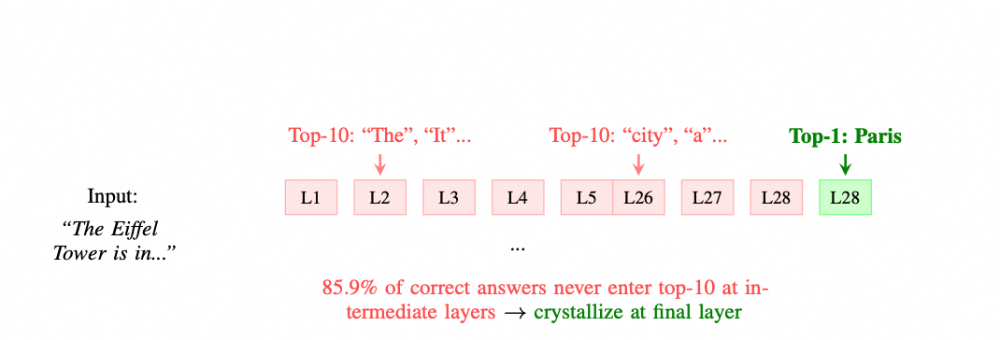
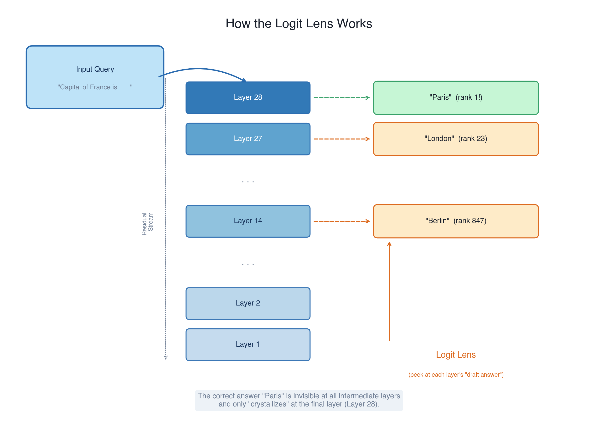
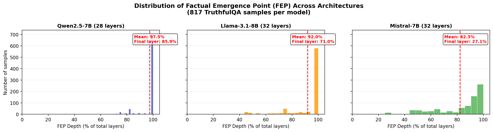

When you ask an LLM a factual question, at which layer does it "know" the answer?

The intuitive answer is *gradually*—knowledge accumulates layer by layer, building up from token embeddings through attention and MLPs until a confident prediction emerges at the output. This is the mental model most of us carry. It feels right.

It's also wrong for 85.9% of cases.

In our recent work, we discovered that the vast majority of factual answers **never appear in any intermediate layer's predictions**. Instead, they remain completely invisible—distributed across the residual stream in an implicit, unreadable form—until the very last layer, where they suddenly "crystallize" into the correct prediction. We call this phenomenon **Late Crystallization**.

This isn't just a curiosity. It has direct, practical implications for anyone trying to make LLMs more truthful: it explains why simple activation scaling produces zero improvement, why DoLa ([Li et al., 2024](https://arxiv.org/abs/2309.03883)) works so well, and why methods like ITI and CAA need a minimum number of layers to show any effect at all.

In this post, I'll walk through the discovery, the evidence, and what it means for the field.

<figure>

<figcaption>Figure 1: Late Crystallization at a glance: the correct answer ("Paris") is invisible throughout intermediate layers and only appears at the final layer.</figcaption>
</figure>

---

## The Mystery

85.9% of correct answers never appear in any intermediate layer of a transformer—then suddenly crystallize at the final layer.

When I first saw this number, I didn't believe it. But let me start at the beginning.

There's a natural idea for improving LLM truthfulness: if certain internal directions encode "truthful" vs. "hallucinated" information, just scale up the truthful direction. Several methods attempt variations of this:

- **Inference-Time Intervention (ITI)** ([Li et al., 2023](https://arxiv.org/abs/2306.03341)): identify truthful directions via probing, then shift activations at inference time
- **Contrastive Activation Addition (CAA)** ([Rimsky et al., 2024](https://arxiv.org/abs/2312.06681)): compute a steering vector from contrastive pairs and add it to activations
- **Simple activation scaling**: uniformly amplify activations at selected layers

We ran all of these on Qwen2.5-7B using TruthfulQA (817 samples). The results were puzzling: **simple scaling produced exactly zero improvement** across all configurations. ITI and CAA also showed **zero improvement at top_k ∈ {3, 5}**—but jumped to +10.0% and +15.5% at top_k = 10. Meanwhile, **DoLa (dynamic) achieved +25.4%**, far ahead of everything else.

Two things stand out:

1. **Simple scaling does literally nothing.** Zero improvement across all configurations.
2. **ITI and CAA show zero improvement at top_k ∈ {3, 5}, but substantial gains at top_k=10.** There's a sharp threshold—intervene on too few layers and nothing happens.

DoLa, which contrasts logits between early and late layers, achieves the largest gain (+25.4%). But *why*? What makes logit-space contrast so much more effective than activation-space steering?

The answer lies in what's actually happening inside the residual stream. To see it, we need a microscope.

---

## Logit Lens: Looking Inside the Transformer

The idea behind the **Logit Lens** ([nostalgebraist, 2020](https://www.lesswrong.com/posts/AcKRB8wDKH48X4KLY/interpreting-gpt-the-logit-lens)) is almost embarrassingly simple: at any intermediate layer, peek at the model's "draft answer." If you ask "What is the capital of France?" and look at layer 14 of 28, what would the model predict *right now*, before it's finished thinking?

<figure>

<figcaption>Figure 2: How the Logit Lens works: at each intermediate layer, we peek at the model's current "draft answer." The correct answer "Paris" is invisible at intermediate layers and only crystallizes at the final layer.</figcaption>
</figure>

Technically, you do this by taking the hidden state at layer $l$, applying the final LayerNorm and unembedding matrix, and reading off a probability distribution over the vocabulary:

$$\text{logits}_l = W_U \cdot \text{LN}(h_l)$$

For a model that "gradually builds up" its answer, you'd expect the correct token to climb steadily in rank across layers—like a blurry photo slowly coming into focus.

To measure this precisely, we defined the **Factual Emergence Point (FEP)**: simply put, it's the earliest layer where the correct answer first "pops up" in the model's top predictions. Think of it as the moment the developing photo first shows a recognizable face.

Formally, for a query $q$ with correct answer $a$:

$$L_{\text{FEP}} = \min\\{l : \text{rank}(a, W_U \cdot \text{LN}(h_l)) \leq k\\}$$

If the correct answer never enters the top-$k$ at any intermediate layer, we set FEP to the final layer (meaning the answer only appeared at the very end). We use $k = 10$ throughout.

We computed the FEP for all 817 TruthfulQA samples on Qwen2.5-7B (28 layers). What we found was startling.

---

## What We Found

### Late Crystallization

The result: **702 out of 817 samples (85.9%) have FEP = 28**—meaning the correct answer *never* entered the top-10 predictions at any intermediate layer. The remaining 14.1% emerge late too, with a mean FEP of 27.3 ± 1.8 out of 28 total layers.

This is not gradual accumulation. This is a **phase transition**—a sudden jump, like water freezing into ice. The correct answer is invisible throughout the entire forward pass—hidden somewhere in the residual stream—and then, at the very last layer, it suddenly "crystallizes" into an explicit, readable prediction.

We call this **Late Crystallization**.

### Is This Just a Probe Artifact?

A natural concern: maybe the Logit Lens is simply a bad probe for intermediate layers, and the knowledge *is* there but we can't see it.

Three lines of evidence argue against this:

1. **Tuned Lens validation.** The Tuned Lens ([Belrose et al., 2023](https://arxiv.org/abs/2303.08112)) is a more sophisticated version of the Logit Lens—it trains a small learned probe at each layer instead of using the raw unembedding matrix. When we re-ran our analysis with the Tuned Lens, we got an 85.7% crystallization rate—virtually identical to the Logit Lens (85.9%). 74.9% of samples have the exact same FEP under both methods.

2. **LayerNorm ablation.** Completely removing the final LayerNorm produces the *exact same* FEP distribution (mean FEP = 27.30, 85.9% crystallization rate). If the phenomenon were a LayerNorm artifact, ablating it should change the FEP pattern. It doesn't.

3. **Systematic cross-architecture gradient.** The crystallization rate varies systematically across architectures (Qwen 85.9% > Llama 71.0% > Mistral 27.1%), correlating with attention mechanism design rather than random variation. An artifact would not produce this clean gradient.

### Top-k Robustness

Late crystallization is remarkably robust to the choice of $k$. Even at $k = 100$ (top 0.1% of the vocabulary), 64.7% of correct answers still never appear at any intermediate layer. The FEP depth exceeds 93% across all thresholds from $k = 1$ to $k = 100$.




### A Spectrum of Knowledge

So 85.9% of factual knowledge crystallizes at the final layer. But is this uniform—does *all* knowledge behave the same way? Or do different types of knowledge crystallize at different depths?

It turns out the answer is beautifully structured. When we broke down FEP by category, a clear gradient emerged: **logical fallacies** crystallize earliest (mean FEP = 22.1), while **history, psychology, and weather** questions *always* crystallize at the final layer (FEP = 28.0, σ = 0.0—zero variance, no exceptions).

We call this the **Computability–Memorization Spectrum**: knowledge types arrange themselves along a gradient from "computable" (derivable through intermediate reasoning steps) to "memorized" (pure parameter lookup). The position on this spectrum determines *when* the answer becomes readable in the residual stream.


This spectrum is consistent across all three architectures we tested, suggesting it reflects a fundamental property of how transformers process different types of knowledge.

So now we have two empirical facts: (1) most factual knowledge crystallizes suddenly at the final layer, and (2) the depth of crystallization varies systematically by knowledge type. The natural next question: *why* does this happen—and what does it tell us about the intervention results we started with?

---

## The Explanation

The crystallization phenomenon and the computability–memorization spectrum together provide a clean, mechanistic explanation for the entire intervention hierarchy we observed in Chapter 1.

But first, why does crystallization happen at all? Here's the intuition: throughout the forward pass, the model doesn't store "Paris" in any single neuron or any readable form. Instead, the knowledge is **spread across hundreds of dimensions** in the residual stream—like a message written in invisible ink. The model's own circuits can read this distributed code, but our probing tools (Logit Lens, Tuned Lens) cannot. Only at the final layer does a nonlinear transformation—the composition of LayerNorm, attention, and MLP—"develop" this invisible ink into a readable answer. That's the crystallization: a nonlinear readout of information that was there all along.

With this understanding, the intervention hierarchy falls into place.

### Simple Scaling: Amplifying Nothing

If 85.9% of correct answers are invisible in intermediate layers, uniformly scaling activations amplifies *both* the noise (wrong predictions) and the implicit signal (correct answer hidden in distributed representations) equally. The signal-to-noise ratio doesn't change. Hence: zero improvement.

### ITI/CAA: The Layer Threshold Mystery

ITI and CAA steer activations at the top-$k$ layers (ranked by probing accuracy). At top_k ∈ {3, 5}, they intervene only on layers near the end—but the crystallization window is so narrow that 3–5 layers don't cover the pre-crystallization zone. At top_k = 10, they finally span enough of the pre-crystallization region to influence the implicit representations *before* they crystallize.

This explains the sharp threshold: **you need to reach deep enough into the pre-crystallization layers for activation steering to matter.**

### DoLa: Contrasting Across the Crystallization Boundary

DoLa works by picking an early "baseline" layer and asking: *"What changed between this early draft and the final answer?"* We found that DoLa almost exclusively picks layers 0–1 as its baseline (mean = 0.95), while the correct answers only appear at layers 27–28. The two are essentially uncorrelated ($r = -0.06$).

This reveals DoLa's true mechanism: it contrasts **surface-level patterns** (earliest layers) against **crystallized knowledge** (final layer), maximally amplifying the factual signal that emerges during crystallization. It doesn't need to know *where* crystallization happens—it just needs the widest possible contrast window.


---

## How Universal Is This?

Everything so far has been on Qwen2.5-7B. A natural question: is Late Crystallization a quirk of one model, or a fundamental property of transformers? We extended the analysis to Llama-3.1-8B (32 layers, GQA) and Mistral-7B (32 layers, GQA + sliding window attention), plus Qwen2.5-14B for scale validation.

- **Qwen2.5-7B** (28 layers): Mean FEP 27.3 ± 1.8, FEP depth **97.5%**, crystallization rate **85.9%**
- **Qwen2.5-14B** (48 layers): Mean FEP 46.0 ± 4.9, FEP depth **95.8%**, crystallization rate **77.7%**
- **Llama-3.1-8B** (32 layers): Mean FEP 29.4 ± 4.9, FEP depth **91.9%**, crystallization rate **71.0%**
- **Mistral-7B** (32 layers): Mean FEP 26.3 ± 6.2, FEP depth **82.3%**, crystallization rate **27.1%**


Two key findings:

1. **Late knowledge emergence is universal.** All four models show factual knowledge emerging at >80% depth. This is not a Qwen quirk.

2. **The degree varies with architecture.** Strict final-layer crystallization ranges from 85.9% (Qwen) to 27.1% (Mistral). Mistral's sliding window attention appears to enable earlier information routing, reducing the concentration at the final layer.

### Scale Invariance

Qwen2.5-14B (48 layers, 14.7B parameters) shows the phenomenon persists at larger scale: FEP depth is 95.8% (vs. 97.5% for 7B), and 77.7% of answers still crystallize at the final layer. The slightly lower strict crystallization rate is consistent with larger model capacity enabling marginally earlier emergence, but the dominant pattern—sudden final-layer crystallization—is preserved.

### Cross-Benchmark: MMLU Validation

To confirm this isn't TruthfulQA-specific, we ran FEP detection on 1,200 MMLU samples. The result: Late Crystallization is *even more* pronounced on MMLU—**98.2%** of correct answers crystallize at the final layer (vs. 85.9% on TruthfulQA), with near-perfect rates across all subject groups (STEM **99.1%**, Humanities **98.0%**, Social Science **97.2%**). This makes sense: MMLU tests primarily memorized domain knowledge, which sits at the "pure memorization" end of the spectrum.

### Architecture-Dependent Intervention Selection

The crystallization rate predicts which intervention works best:

- **High crystallization (Qwen, 85.9%)** → DoLa excels (**+25.4%**), because logit contrast across the crystallization boundary is maximally informative when knowledge is invisible until the very end.
- **Medium crystallization (Llama, 71.0%)** → CAA excels (**+33.5%**), because knowledge is distributed more gradually, giving activation steering a wider window to reach it.
- **Low crystallization (Mistral, 27.1%)** → CAA again (**+32.3%**), for the same reason—knowledge is already accessible at intermediate layers.

This suggests a practical recipe: **measure your model's crystallization rate first, then pick your intervention.**

---

## A Free Lunch

We've established that Late Crystallization is a universal property of transformers—not a quirk of one model or one benchmark. A natural follow-up: can we *exploit* this understanding for a practical improvement?

Among all interventions, one stands out for its simplicity.

We performed LayerNorm ablation and scaling experiments on Qwen2.5-7B. Two surprising findings:

**First, completely removing LayerNorm doesn't change the FEP distribution at all** (Mean FEP = 27.30, crystallization rate stays at 85.9%). This is strong evidence that crystallization is an intrinsic property of the residual stream, not a LayerNorm artifact.

**Second, slightly amplifying LayerNorm (×1.2) acts as a "crystallization amplifier"**—it sharpens the phase transition and yields **+11.8% MC1 improvement** with **zero inference overhead** (one element-wise multiplication). Scaling further to ×1.5 pushes crystallization to 95.7% but overshoots the sweet spot (only +9.0%). Compare the best case to DoLa's +25.4% at 2× forward pass cost—LN scaling gives you nearly half the benefit for free.

In code, it's literally one line:

```python
# After the final transformer block, before unembedding:
hidden_states = model.ln_final(hidden_states) * 1.2
```

This is the kind of finding that bridges research and engineering: a mechanistic insight (crystallization is intrinsic to the residual stream; LayerNorm amplifies it) leading to a zero-cost practical improvement.

---

## Looking Ahead

### What Late Crystallization Tells Us About LLMs

The most striking implication is that **LLMs don't "think" the way we imagine.** The gradual-buildup mental model—where knowledge accumulates layer by layer—is empirically wrong for the vast majority of factual queries. Instead, the model performs some opaque, distributed computation throughout its depth, and the answer only becomes "readable" at the very end.

This has a humbling consequence for interpretability: **if you're probing intermediate layers to understand what a model "knows," you're likely missing most of the picture.** The knowledge is there—it must be, since the model gets the answer right—but it's encoded in a form that our current probing tools can't decode until the final layer's transformation makes it explicit.

### The Computability–Memorization Spectrum Is Underexplored

I think the category-level FEP variation is the most underappreciated finding in our paper. The clean gradient from "computable" knowledge (logical fallacies, FEP ≈ 22) to "memorized" knowledge (history, FEP = 28) suggests that transformers implement fundamentally different processing pathways for different types of knowledge. This deserves much deeper investigation—perhaps different architectural choices could optimize for one or the other.

### Instruction Tuning Reshapes Crystallization

Our pilot on Qwen2.5-7B-Instruct revealed that instruction tuning dramatically reduces the strict crystallization rate (37.3% vs. 85.9% for the base model) while preserving late knowledge emergence overall (FEP depth = 91.0%). This means RLHF/instruction tuning *teaches the model to surface knowledge earlier*—which should make activation-space interventions (ITI, CAA) more effective on instruction-tuned models.

This prediction aligns with SADI's ([Zhang et al., 2025](https://arxiv.org/abs/2502.06769)) strong results (MC1 = 67%) on instruction-tuned models using activation-space methods. The crystallization framework provides a mechanistic explanation for why: instruction tuning shifts the crystallization boundary, opening a wider window for activation steering.

### What I'd Do Next

If I were continuing this line of research:

1. **Category-adaptive intervention**: use per-category FEP profiles to select different interventions for different knowledge types within a single forward pass.
2. **70B+ validation**: does crystallization rate decrease with scale, or is it truly scale-invariant?
3. **Training dynamics**: when during pre-training does late crystallization emerge? Is it present from early checkpoints or does it develop?
4. **Multi-token FEP**: extend FEP tracking across decoding steps for open-ended generation.

---

## Conclusion

Late Crystallization reveals that factual knowledge in LLMs undergoes a sudden phase transition at the final layer—not the gradual accumulation that intuition suggests. This phenomenon is universal across architectures (validated on Qwen, Llama, Mistral), scales (7B–14B), benchmarks (TruthfulQA, MMLU), and probing methods (Logit Lens, Tuned Lens).

It provides a unified mechanistic explanation for the intervention hierarchy: DoLa works by contrasting across the crystallization boundary; ITI/CAA need enough layers to reach the pre-crystallization zone; simple scaling fails because it can't selectively amplify the nonlinear crystallization process.

And it leads to a practical insight: LayerNorm ×1.2 amplifies crystallization for +11.8% MC1 improvement at zero inference cost.

The code is available as [MechLens](https://github.com/hellogxp/MechLens), supporting Qwen, Llama, Mistral, and more.

*If you found this post useful, I'd love to hear your thoughts on [Twitter/X](https://twitter.com/hellogxp) or in the comments below.*

---

## Citation

Please cite this work as:

> Gao, Xueping. "Late Crystallization in LLMs: How Facts Emerge in the Final Layers". Xueping's Blog (Jun 2026). https://hellogxp.github.io/posts/late-crystallization/.

Or

```
@article{gao2026latecrystallization,
  title   = {Late Crystallization in LLMs: How Facts Emerge in the Final Layers},
  author  = {Gao, Xueping},
  journal = {hellogxp.github.io},
  year    = {2026},
  month   = {Jun},
  url     = "https://hellogxp.github.io/posts/late-crystallization/"
}
```

---

## References

[1] Belrose et al. ["Eliciting Latent Predictions from Transformers with the Tuned Lens"](https://arxiv.org/abs/2303.08112). ICLR 2023.

[2] Li et al. ["Inference-Time Intervention: Eliciting Truthful Answers from a Language Model"](https://arxiv.org/abs/2306.03341). NeurIPS 2023.

[3] Li et al. ["DoLa: Decoding by Contrasting Layers Improves Factuality and Faithfulness of Large Language Models"](https://arxiv.org/abs/2309.03883). ICLR 2024.

[4] Mor et al. ["Summing Up the Facts: Additive Mechanisms Behind Factual Recall in LLMs"](https://arxiv.org/abs/2402.12837). 2024.

[5] nostalgebraist. ["interpreting GPT: the logit lens"](https://www.lesswrong.com/posts/AcKRB8wDKH48X4KLY/interpreting-gpt-the-logit-lens). LessWrong, 2020.

[6] Rimsky et al. ["Steering Llama-2 via Contrastive Activation Addition"](https://arxiv.org/abs/2312.06681). AAAI 2024.

[7] Zhang et al. ["SADI: Semantic-Adaptive Dynamic Intervention for Hallucination Mitigation"](https://arxiv.org/abs/2502.06769). ICLR 2025.
