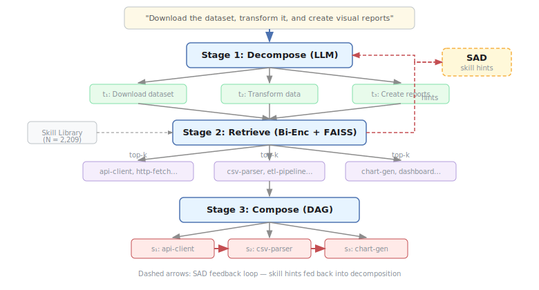
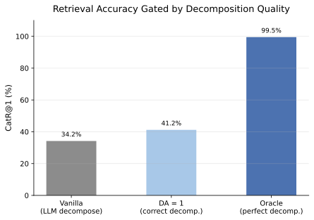
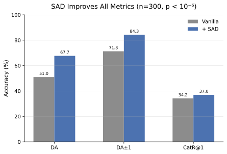
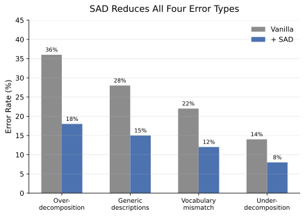
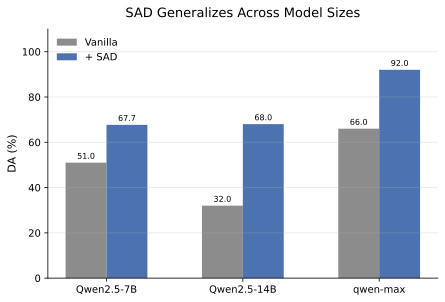
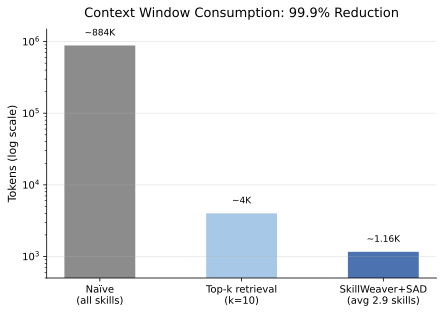

When you ask an LLM agent to "download the dataset, transform it, and create visual reports," it needs to find and chain three different skills: a file fetcher, a data transformer, and a chart generator. This is **compositional skill routing**—and the bottleneck might not be where you think.

Here's the surprise: if you give an LLM the *perfect* decomposition of that query into sub-tasks, retrieval accuracy hits **99.5%**. But when the LLM decomposes the query itself, accuracy drops to **34.2%**. A 65-percentage-point gap—and it's entirely in the decomposition step, not the retrieval step.

This post walks through why decomposition fails, how to fix it with a method called **Skill-Aware Decomposition (SAD)**, and why the fix works by *correcting granularity* rather than *boosting model capacity*.

## Compositional Skill Routing

### The Problem

LLM agents increasingly rely on external skills—reusable tool specifications that extend what the model can do. Early work like [Toolformer](https://arxiv.org/abs/2302.04761) taught models to call APIs autonomously; [Gorilla](https://arxiv.org/abs/2304.04670) scaled to massive API collections. With the [Model Context Protocol (MCP)](https://modelcontextprotocol.io/) ecosystem now boasting thousands of skills across categories like file I/O, data processing, web search, and code execution, agents face a new challenge: real tasks require *composing* multiple skills, not just selecting one.

Prior work like [SkillRouter](https://arxiv.org/abs/2603.22455) and [Gorilla](https://arxiv.org/abs/2304.04670) has largely focused on single-skill selection: given a query, pick the best tool. But when a user says "download the dataset, transform it, and create visual reports," no single skill suffices. The agent must:

1. **Decompose** the query into atomic sub-tasks
2. **Retrieve** the appropriate skill for each sub-task
3. **Compose** the skills into an executable plan (DAG)

We call this **Compositional Skill Routing**. Each stage has its own challenges, but as we'll see, one stage dominates.

### SkillWeaver

To study this problem, we built [SkillWeaver](https://arxiv.org/abs/2606.18051), a three-stage framework:

- **Stage 1 — Decompose**: An LLM (Qwen2.5-7B-Instruct by default) breaks the query into sub-tasks. The input is the natural language query; the output is a list of atomic steps, each described in a sentence.
- **Stage 2 — Retrieve**: A bi-encoder (all-MiniLM-L6-v2, 384-dim) encodes each sub-task and searches a [FAISS](https://arxiv.org/abs/2401.08281) index of skill metadata. The top-*k* candidates per sub-task form the candidate set.
- **Stage 3 — Compose**: A compatibility-aware DAG planner arranges the selected skills into a dependency graph, ensuring execution order respects data flow constraints.

<figure>

<figcaption>Figure 1: The SkillWeaver pipeline. A query is decomposed into sub-tasks, each matched to skills via bi-encoder retrieval, then composed into a DAG. Dashed arrows: SAD feedback loop.</figcaption>
</figure>

### CompSkillBench

To evaluate, we built **CompSkillBench**: 300 compositional queries over **2,209 real MCP server skills** spanning **24 functional categories**, sourced from the public [awesome-mcp-servers](https://github.com/punkpeye/awesome-mcp-servers) registry. Queries are stratified into three difficulty levels: Easy (2 skills), Medium (3 skills), and Hard (4+ skills).

### Evaluation Metrics

Two metrics matter most:

- **Decomposition Accuracy (DA)**: Does the number and identity of decomposed sub-tasks match the ground-truth skill set? DA=1 means exact match; DA±1 means off by at most one step.
- **Category Recall at K (CatR@K)**: Of the top-*k* retrieved skills per sub-task, what fraction contain the correct category? This measures retrieval quality conditioned on the decomposition.

## Decomposition as the Bottleneck

### The Oracle Experiment

The first question: *where* does the pipeline fail? To isolate this, we ran an oracle experiment. We bypassed the LLM decomposer and fed the ground-truth decomposition directly into the retriever.

The result: **CatR@1 = 99.5%** with oracle decomposition. The retriever is essentially perfect when given the right sub-tasks.

Now the real number: with vanilla LLM decomposition (Qwen2.5-7B), CatR@1 drops to **34.2%**. That's a 65-percentage-point gap—*entirely* attributable to decomposition quality.

### DA Gates Retrieval

We can see this gating effect more precisely. When we condition on DA=1 (correct decomposition), CatR@1 jumps from **34.2% to 41.2%**—a 20% relative improvement. CatR@10 rises to **81.6%**. The retriever isn't broken; it's being fed the wrong queries.

<figure>

<figcaption>Figure 2: Retrieval accuracy gated by decomposition quality. When decomposition is correct (DA=1), CatR@1 jumps 34.2% → 41.2%. With oracle decomposition, it reaches 99.5%. The gap is in the decomposition, not the retrieval.</figcaption>
</figure>

### Why Decomposition Fails

We analyzed 50 vanilla decomposition failures and found four recurring patterns:

- **Over-decomposition (36%)**: The LLM breaks "download the dataset" into "check internet connection," "find the URL," "send HTTP request," "save to disk"—four steps when one suffices. Each extra step introduces noise that degrades retrieval.
- **Generic descriptions (28%)**: The LLM writes "process the data" instead of "parse CSV and compute statistics." The description is too vague to match any specific skill.
- **Vocabulary mismatch (22%)**: The LLM says "render visualization" but the skill library has "chart-gen." Semantic gap between decomposition language and skill metadata.
- **Under-decomposition (14%)**: The LLM merges "download" and "transform" into one step, losing the distinction needed to retrieve two different skills.

The common thread: the LLM decomposes *without knowing what skills exist*. It's writing a recipe without seeing the ingredients.

This connects to a broader pattern in task decomposition research. [Chain-of-Thought](https://arxiv.org/abs/2201.11903) and [Decomposed Prompting](https://arxiv.org/abs/2210.02442) showed that breaking complex tasks into steps improves LLM performance. But these methods decompose in a vacuum—they don't account for what tools are actually available. The result is sub-tasks that are technically correct but semantically misaligned with the skill library.

## Skill-Aware Decomposition

### The Idea

SAD (Skill-Aware Decomposition) addresses this with a simple feedback loop: **retrieve skill hints first, then feed them back into the decomposition prompt**.

Here's the intuition: imagine ordering at a restaurant. If you've never seen the menu, you might ask for "something Italian"—vague, hard to match. But if you glance at the menu first, you can say "I'll have the carbonara"—specific, exactly matchable. SAD gives the decomposer a glance at the skill library before it writes the sub-tasks.

### How It Differs from Standard RAG

This is **input-side feedback**, not output-side. Standard RAG (e.g., [Self-RAG](https://arxiv.org/abs/2310.11511)) retrieves documents to help the model *answer* better. SAD retrieves skill hints to help the model *decompose* better—to ask better questions, not to give better answers.

- **Output-side (standard RAG)**: Retrieve documents to help the model *answer* better. Examples: [Self-RAG](https://arxiv.org/abs/2310.11511), [ReAct](https://arxiv.org/abs/2210.03629), [Reflexion](https://arxiv.org/abs/2303.11366).
- **Input-side (SAD)**: Retrieve skill hints to help the model *decompose* better—to ask better questions, not to give better answers.

This distinction matters because it means SAD is *complementary* to any output-side RAG the agent might also use downstream.

### Results

SAD improves decomposition accuracy from **51.0% to 67.7%** (+32.7% relative, Wilcoxon p < 10⁻⁶, n=300) in a single iteration. DA±1 rises from 71.3% to **84.3%**. Category recall improves from 34.2% to **37.0%** at CatR@1 and 68.6% to **70.3%** at CatR@10.

<figure>

<figcaption>Figure 3: SAD improves all metrics. DA: 51.0% → 67.7% (+32.7% relative). CatR@1: 34.2% → 37.0%. One iteration suffices for DA; CatR@1 peaks at round 2.</figcaption>
</figure>

### Convergence

One SAD iteration is enough for DA. CatR@1 continues to improve at round 2 (**38.9%**) before slightly declining at round 3, likely due to hint vocabulary fixation (Jaccard similarity rises 0.32 → 0.47 → 0.52, indicating progressive convergence to a stable skill vocabulary).

## Granularity Correction, Not Capacity Boost

### The Oracle-K Experiment

The key question: does SAD make the model *smarter*, or does it help it decompose at the *right granularity*?

To test this, we designed an oracle-step-count baseline. We give the LLM the correct number of sub-tasks (but not the content) and ask it to decompose. If SAD works by boosting capacity, this oracle should match SAD's retrieval gains. If SAD works by correcting granularity, the oracle should close the DA gap but not necessarily the CatR@1 gap.

Results: oracle step count gives DA=**99.3%** but CatR@1=**39.8%**. Compare with SAD's DA=1-conditioned CatR@1 of **41.2%**. These are nearly identical.

**SAD is a granularity corrector, not a capacity booster.** It doesn't make the model write better sub-task descriptions—it helps the model produce the right *number* of steps, which in turn enables the retriever to find the right skills.

### Error Reduction

After SAD, the error distribution shifts:

- Over-decomposition drops from 36% to 18%
- Generic descriptions drop from 28% to 15%
- Vocabulary mismatch drops from 22% to 12%
- Under-decomposition drops from 14% to 8%

<figure>

<figcaption>Figure 4: SAD reduces all four error types. The largest reductions are in over-decomposition (36% → 18%) and generic descriptions (28% → 15%)—exactly the errors caused by not knowing the skill library.</figcaption>
</figure>

The largest reductions are in over-decomposition and generic descriptions—exactly the errors caused by not knowing the skill library.

## Generalization Across Models and Tasks

### Cross-Model Validation

SAD generalizes across model sizes and families:

- **Qwen2.5-7B**: DA 51.0% → 67.7% (+32.7% relative)
- **Qwen2.5-14B**: DA 32.0% → 68.0% (+36pp absolute; the larger model over-decomposes more, but SAD corrects it)
- **qwen-max** (50 queries): DA 66.0% → 92.0% (+39.4% relative)

The 14B result is notable: vanilla decomposition is *worse* than 7B (32% vs 51% DA) because the larger model tends to over-decompose (avg 4.72 predicted steps vs ground-truth mean 2.94). SAD brings it down to 3.18—closer to the right granularity. Bigger isn't always better; *calibrated* is better.

<figure>

<figcaption>Figure 5: SAD generalizes across model sizes. All three models benefit, though the 14B model has the largest gain because SAD corrects its over-decomposition tendency.</figcaption>
</figure>

### Human-Style Queries

We generated 200 human-style queries with zero overlap with the training set. These are messier, more natural-language versions of the benchmark queries. On these:

- Strict DA: 8.5% → 21.5%
- Relaxed DA±1: **30.5% → 50.5%** (+66% relative)

SAD works on queries the model has never seen, written in natural human style.

### Unseen Skills

We tested generalization to skills not in the retrieval pool:

- **Category held-out** (security + code-execution removed): +35.6% relative DA gain
- **Random skill held-out** (80/20 split): +23.2% relative DA gain

SAD generalizes because it teaches the decomposer the *style* of skills available, not specific skill names.

### Paraphrase Robustness

On 200 paraphrased queries, DA drops by at most 6 percentage points; CatR@1 stays stable (33–38%). SAD is robust to surface-level wording variation.

## Practical Implications

### Context Window Reduction

The most immediate practical benefit: **99.9% context window reduction**.

- Naïve approach: dump all 2,209 skill descriptions into the prompt → ~884K tokens
- SkillWeaver + SAD: retrieve only the needed skills → ~1,160 tokens (avg 2.9 skills per query)

<figure>

<figcaption>Figure 6: Context window consumption. Naïve approach requires ~884K tokens to include all 2,209 skills. SkillWeaver + SAD needs only ~1,160 tokens—a 99.9% reduction, making skill routing feasible for any model regardless of context window size.</figcaption>
</figure>

This makes skill routing feasible for any model, regardless of context window size. A 7B model with a 4K context window can route across 2,209 skills.

### The Reranker Lever

SAD improves decomposition, but retrieval quality still has headroom. A pilot with an LLM-listwise reranker on top of SAD pushes CatR@1 from **37.1% to 40.9%** (+10.3% relative, p < 0.01). The reranker and SAD are orthogonal—they fix different parts of the pipeline.

An encoder upgrade provides similar gains: swapping all-MiniLM-L6-v2 for [BGE-base](https://arxiv.org/abs/2309.07597) improves CatR@1 from 39.4% to 45.1% (+14.5% relative), also orthogonal to SAD.

### End-to-End Pilot

The compose stage is still in pilot. On 30 queries with mock executors: DA = 86.7%, step execution success = 86.9%, chain completion rate = **76.7%**. The compose stage introduces additional failure modes (dependency resolution, API compatibility) that warrant future work.

### My Take

The "decomposition bottleneck" pattern likely generalizes beyond skill routing. Any system where a model must break down a task *before* retrieval—whether routing skills, selecting APIs, or planning multi-step queries—will hit this wall. The model doesn't fail because it can't find the answer; it fails because it asks the wrong question.

SAD's input-side feedback is an underexplored direction. Most RAG research focuses on output-side: retrieve to *answer* better. SAD retrieves to *ask* better. This is a fundamentally different leverage point, and it's cheap—one retrieval pass before decomposition, no fine-tuning, no model upgrade.

The MCP ecosystem makes this problem real. With 2,209 skills and growing, agents can't brute-force by stuffing everything into the context window. Decomposition-aware routing isn't a nice-to-have; it's the only scalable path.

## Citation

Please cite this work as:

> Gao, Xueping. "Compositional Skill Routing: Decomposition Is the Bottleneck". Xueping's Blog (Jun 2026). https://hellogxp.github.io/posts/skill-routing/

Or use the BibTex citation:

```bibtex
@article{gao2026skillrouting,
  title   = {Compositional Skill Routing: Decomposition Is the Bottleneck},
  author  = {Gao, Xueping},
  journal = {hellogxp.github.io},
  year    = {2026},
  month   = {Jun},
  url     = "https://hellogxp.github.io/posts/skill-routing/"
}
```

## References

[1] Gao, Xueping. ["Compositional Skill Routing for LLM Agents: Decompose, Retrieve, and Compose"](https://arxiv.org/abs/2606.18051). arXiv:2606.18051 (2026). *(This work — the source paper this post is based on.)*

[2] Yao, S. et al. ["ReAct: Synergizing Reasoning and Acting in Language Models"](https://arxiv.org/abs/2210.03629). ICLR 2023.

[3] Shinn, N. et al. ["Reflexion: Language Agents with Verbal Reinforcement Learning"](https://arxiv.org/abs/2303.11366). NeurIPS 2023.

[4] Schick, T. et al. ["Toolformer: Language Models Can Teach Themselves to Use Tools"](https://arxiv.org/abs/2302.04761). NeurIPS 2023.

[5] Asai, A. et al. ["Self-RAG: Learning to Retrieve, Generate, and Critique through Self-Reflection"](https://arxiv.org/abs/2310.11511). ICLR 2024.

[6] Zheng, Y. et al. ["SkillRouter: Retrieve-and-Rerank Skill Selection for LLM Agents at Scale"](https://arxiv.org/abs/2603.22455). arXiv:2603.22455 (2025).

[7] Patil, S. et al. ["Gorilla: Large Language Model Connected with Massive APIs"](https://arxiv.org/abs/2304.04670). ICML 2024.

[8] Wei, J. et al. ["Chain-of-Thought Prompting Elicits Reasoning in Large Language Models"](https://arxiv.org/abs/2201.11903). NeurIPS 2022.

[9] Khot, T. et al. ["Decomposed Prompting: A Modular Approach for Solving Complex Tasks"](https://arxiv.org/abs/2210.02442). ICLR 2023.

[10] Anthropic. ["Model Context Protocol"](https://modelcontextprotocol.io/). 2024.
